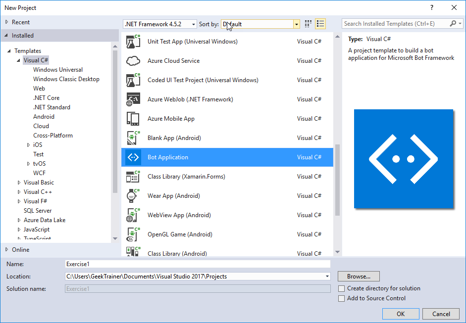
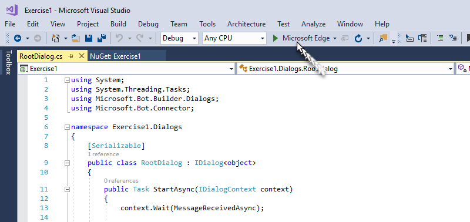
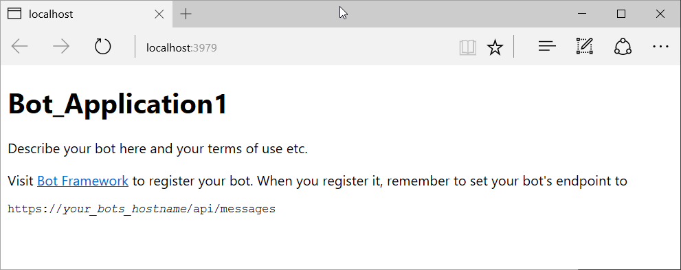
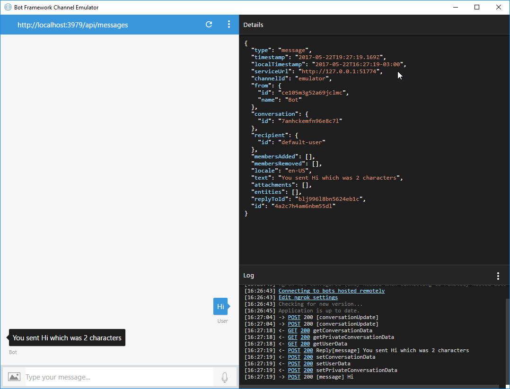

# Exercise 1: Creating Your First "Echo" Bot with the Bot Builder SDK for .NET

## Introduction

This exercise will show you how to build a bot by using the [Bot Builder SDK for .NET](https://github.com/Microsoft/BotBuilder) and then test it with the Bot Framework Emulator.

The Bot Builder SDK for .NET is an easy to use framework for developing bots using Visual Studio and Windows. The SDK leverages C# to provide a familiar way for .NET developers to create powerful bots.

Inside [this folder](./exercise1-EchoBot) you will find a Visual Studio solution with the code that results from completing the steps in this exercise. You can use this solutions as guidance if you need additional help as you work through this exercise.

> **NOTE:** The Bot Builder SDK for .NET currently supports C#. Visual Studio for Mac is not supported.

## Prerequisites

Get started by completing the following prerequisite tasks:

* [Visual Studio 2017 Community](https://www.visualstudio.com/downloads) or higher
* [Bot Framework Emulator](https://emulator.botframework.com), which is the client you will use for testing your bot

## Task 1: Create a New Bot using the Bot Application Template

1. Download the [Bot Application template](http://aka.ms/bf-bc-vstemplate) and install the template by saving the .zip file to your Visual Studio 2017 project templates directory which is typically located here: `%USERPROFILE%\Documents\Visual Studio 2017\Templates\ProjectTemplates\Visual C#\`

1. Open Visual Studio and create a new C# project. Choose the Bot Application template for your new project. Use `HelpDeskBot` as project name in order avoid issues with the namespaces in the next exercises.

    

    By using the Bot Application template, you're creating a project that already contains all of the components that are required to build a simple bot, including a reference to the **Bot Builder SDK for .NET**, included in the `Microsoft.Bot.Builder` NuGet package. However, first make sure you are using the latest version of the SDK.

1. Right click on your project's **References** folder in the **Solution Explorer** and click **Manage NuGet packages**.

1. In the Updates tab, type _Microsoft.Bot.Builder_.

1. Locate the package in the list of search results, and click the **Update** button for that package.

1. Follow the prompts to accept the changes and update the package.

Thanks to the Bot Application template, your project contains all of the code that's necessary to create the bot in this tutorial. You won't actually need to write any additional code. However, before we move on to testing your bot, take a quick look at some of the code that the bot application template provides.

## Task 2: Explore the Bot Code

1. First, the Post method within `Controllers\MessagesController.cs` receives the message from the user and invokes the root dialog.

    Dialogs are used to model a conversation and manage conversation flow. Each dialog is an abstraction that encapsulates its own state in a C# class that implements IDialog. A dialog can be composed with other dialogs to maximize reuse, and a dialog context maintains the stack of dialogs that are active in the conversation at any point in time. Also, a conversation that comprises dialogs is portable across computers, which makes it possible for your bot implementation to scale.

    ```csharp
    [BotAuthentication]
    public class MessagesController : ApiController
    {
        /// <summary>
        /// POST: api/Messages
        /// Receive a message from a user and reply to it
        /// </summary>
        public async Task<HttpResponseMessage> Post([FromBody]Activity activity)
        {
            if (activity.Type == ActivityTypes.Message)
            {
                await Conversation.SendAsync(activity, () => new Dialogs.RootDialog());
            }
            else
            {
                HandleSystemMessage(activity);
            }
            var response = Request.CreateResponse(HttpStatusCode.OK);
            return response;
        }
        ...
    }
    ```

1. The root dialog processes the message and generates a response. The `MessageReceivedAsync` method within `Dialogs\RootDialog.cs` sends a reply that echoes back the user's message, prefixed with the text _'You sent'_ and ending in the text _'which was ## characters'_, where ## represents the number of characters in the user's message.

    Dialogs help organize the logic in your bot and manage conversation flow. Dialogs are arranged in a stack, and the top dialog in the stack processes all incoming messages until it is closed or a different dialog is invoked.

    ```csharp
    [Serializable]
    public class RootDialog : IDialog<object>
    {
        public Task StartAsync(IDialogContext context)
        {
            context.Wait(MessageReceivedAsync);
            return Task.CompletedTask;
        }

        private async Task MessageReceivedAsync(IDialogContext context, IAwaitable<object> result)
        {
            var activity = await result as Activity;

            // calculate something for us to return
            int length = (activity.Text ?? string.Empty).Length;

            // return our reply to the user
            await context.PostAsync($"You sent {activity.Text} which was {length} characters");

            context.Wait(MessageReceivedAsync);
        }
    }
    ```

## Task 3: Test the Bot

Next, test your bot by using the Bot Framework Emulator to see it in action. The emulator is a desktop application that lets you test and debug your bot on localhost or running remotely through a tunnel. The emulator displays messages as they would appear in a web chat UI and logs JSON requests and responses as you exchange messages with your bot.

1. First, you'll need to download and install the emulator. Browse [here](https://emulator.botframework.com/) to download it. After the download completes, launch the executable and complete the installation process.

1. After installing the emulator, start your bot in Visual Studio by using a IIS Express as the application host.

    

1. When you click the **Run** button, Visual Studio will build the application, deploy it to localhost, and launch the web browser to display the application's `default.htm` page as follows:

    

    > **NOTE:** If you get a Windows Firewall alert, click **Allow access**.

1. Next, start the emulator and then connect your bot. Type `http://localhost:3979/api/messages` into the address bar. This is the default endpoint that your bot listens to when hosted locally.

1. Set the **Locale** as `en-US` and click **Connect**. Because you are running your bot locally, you won't need to specify **Microsoft App ID** and **Microsoft App Password**. You can leave these fields blank for now. You'll get this information in Exercise 5 when you register your bot in the Bot Framework Portal.

1. You may see that the bot responds to each message you send by echoing back your message prefixed with the text "You said" and ending in the text 'which was ## characters', where ## represents the number of characters in the user's message.

    