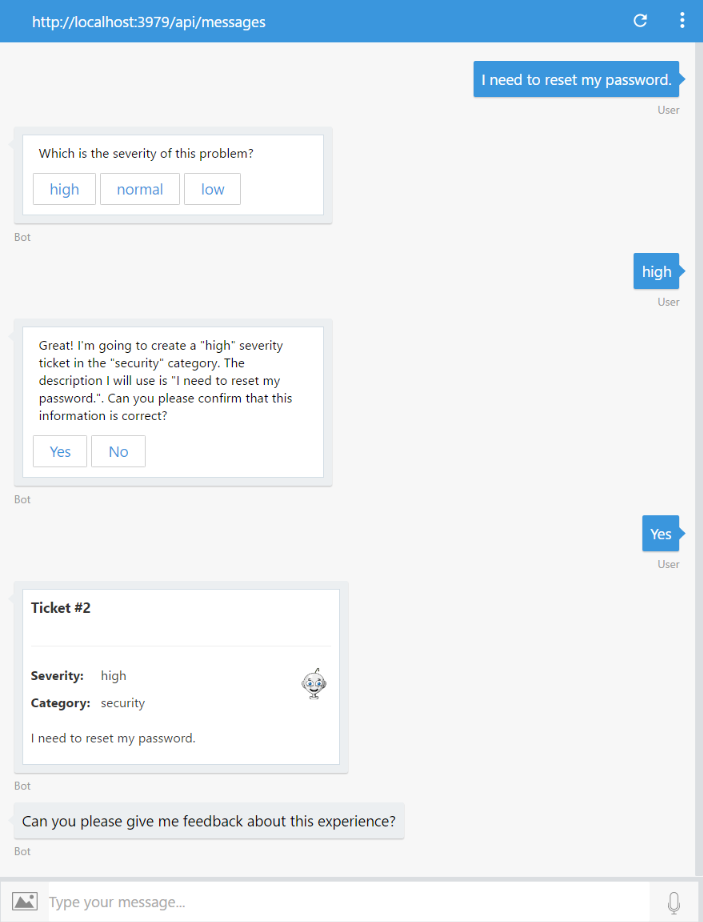
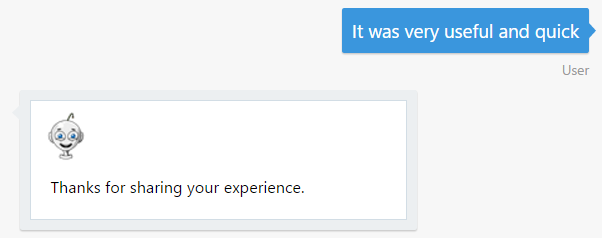
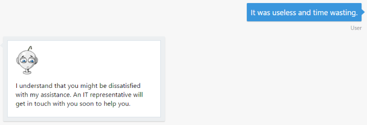

# Exercise 6: Determine the Sentiments Behind a User's Message (C#)

## Introduction

The interaction between users and bots is mostly free-form, so bots need to understand language naturally and contextually. In this exercise you will learn how to detect the user's sentiments and mood using the Azure Text Analytics API.

With [Text Analytics APIs](https://azure.microsoft.com/en-us/services/cognitive-services/text-analytics/), part of the Azure Cognitive Services offering, you can  detect sentiment, key phrases, topics, and language from your text. The API returns a numeric score between 0 and 1. Scores close to 1 indicate positive sentiment and scores close to 0 indicate negative sentiment. Sentiment score is generated using classification techniques.

Inside [this folder](./exercise6-MoodDetection) you will find a solution with the code that results from completing the steps in this exercise. You can use this solution as guidance if you need additional help as you work through this exercise. Remember that before using it, you first need to complete the values in Web.config.

## Prerequisites

The following software is required for completing this exercise:

* [Visual Studio 2017 Community](https://www.visualstudio.com/downloads) or higher
* An [Azure](https://azureinfo.microsoft.com/us-freetrial.html?cr_cc=200744395&wt.mc_id=usdx_evan_events_reg_dev_0_iottour_0_0) subscription
* The [Bot Framework Emulator](https://emulator.botframework.com) (make sure it's configured with the `en-US` Locale)

## Task 1: Create the Text Analytics API Key

In this task you will create a Text Analytics account.

1. Browse [here](https://azure.microsoft.com/en-us/try/cognitive-services/), select the **Language** tab. Find the *Text Analytics API* and click **Create**. You will be prompted to agree the terms of use and choose your country, next click **Next**.

1. Log in with your **Azure Subscription account**. You should be taken to a page like the following one with an evaluation key with 5000 free requests per month. Save one of the keys for later.

    

## Task 2: Add the Text Analytics API Client

In this task you will create a new class to call the **Text Analytics API** from the bot.

1. Open the solution you've obtained from exercise 4. Alternatively, you can use the app from the [exercise4-KnowledgeBase](./exercise4-KnowledgeBase) folder.

    > **NOTE:** If you use the solution provided remember to replace:
    > * the **[LuisModel("{LUISAppID}", "{LUISKey}")]** attribute in `Dialogs\RootDialog.cs` with your LUIS App Id and Programmatic API Key (as explained in exercise 3)
    > * the **AzureSearchAccount** and **AzureSearchKey** in `Web.config` with your search account name and key (as explained in exercise 4)

1. Copy the [TextAnalyticsService.cs](../assets/exercise6-MoodDetection/TextAnalyticsService.cs) in the project's **Services** folder. This file contains three classes to consume the Text Analytics API.

    > **NOTE:** Notice that the client is hitting the `/sentiment` endpoint. The Text Analytics API also provides the `/keyPhrases` and `/languages` endpoints. Also notice that you can send more than one document to analyze.

1. Update your `Web.Config` file in your project's root folder adding the key **TextAnalyticsApiKey** under the **appSettings** section. Complete the `TextAnalyticsApiKey` value with the **Text Analytics key** you've obtained in the previous task.

    ``` xml
    <add key="TextAnalyticsApiKey" value="" />
    ```

1. In the **Dialogs** folder, create a new class `UserFeedbackRequestDialog.cs` using the following boilerplate code. This dialog will have the responsibility of handle the interaction with the service.

    ```CSharp
    namespace HelpDeskBot.Dialogs
    {
        using System;
        using System.Collections.Generic;
        using System.Threading.Tasks;
        using Microsoft.Bot.Builder.Dialogs;
        using Microsoft.Bot.Connector;
        using Services;

        [Serializable]
        public class UserFeedbackRequestDialog : IDialog<object>
        {
            private readonly TextAnalyticsService textAnalyticsService = new TextAnalyticsService();

            public async Task StartAsync(IDialogContext context)
            {

            }
        }
    }
    ```

1. Replace the `StartAsync` method's implementation to ask the user to provide feedback about the bot.

    ```CSharp
    public async Task StartAsync(IDialogContext context)
    {
        PromptDialog.Text(context, this.MessageReceivedAsync, "Can you please give me feedback about this experience?");
    }
    ```

1. Add a new method called `MessageReceivedAsync`. This method receives the user's response and sends it to the Text Analytics API to evaluate the user sentiments. Depending on the response (greater or lower than 0.5) a different message is displayed to the user.

    ```CSharp
    public async Task MessageReceivedAsync(IDialogContext context, IAwaitable<string> result)
    {
        var response = await result;

        double score = await this.textAnalyticsService.Sentiment(response);

        if (score == double.NaN)
        {
            await context.PostAsync("Ooops! Something went wrong while analyzing your answer. An IT representative agent will get in touch with you to follow up soon.");
        }
        else
        {
            string cardText = string.Empty;
            string cardImageUrl = string.Empty;

            if (score < 0.5)
            {
                cardText = "I understand that you might be dissatisfied with my assistance. An IT representative will get in touch with you soon to help you.";
                cardImageUrl = "https://raw.githubusercontent.com/GeekTrainer/help-desk-bot-lab/master/assets/botimages/head-sad-small.png";
            }
            else
            {
                cardText = "Thanks for sharing your experience.";
                cardImageUrl = "https://raw.githubusercontent.com/GeekTrainer/help-desk-bot-lab/master/assets/botimages/head-smiling-small.png";
            }

            var msg = context.MakeMessage();
            msg.Attachments = new List<Attachment>
            {
                new HeroCard
                {
                    Text = cardText,
                    Images = new List<CardImage>
                    {
                        new CardImage(cardImageUrl)
                    }
                }.ToAttachment()
            };
            await context.PostAsync(msg);
        }

        context.Done<object>(null);
    }
    ```

    > **NOTE:** For sentiment analysis, it's recommended that you split text into sentences. This generally leads to higher precision in sentiment predictions.

## Task 3: Modify the Bot to Ask for Feedback and Analyze the User's Sentiments

1. Open the `RootDialog.cs` in the **Dialogs** folder. Locate the `IssueConfirmedMessageReceivedAsync` method. Update the code block when the user confirmed the ticket to call the `UserFeedbackRequestDialog` dialog and ask the user for feedback. Also move the `context.Done<object>(null);` line inside the last `else`. The resulting code should look as follows.

    ``` csharp
    private async Task IssueConfirmedMessageReceivedAsync(IDialogContext context, IAwaitable<bool> argument)
    {
        var confirmed = await argument;

        if (confirmed)
        {
            ...

            if (ticketId != -1)
            {
                ...
            }
            else
            {
                await context.PostAsync("Ooops! Something went wrong while I was saving your ticket. Please try again later.");
            }

            context.Call(new UserFeedbackRequestDialog(), this.ResumeAndEndDialogAsync);
        }
        else
        {
            await context.PostAsync("Ok. The ticket was not created. You can start again if you want.");
            context.Done<object>(null);
        }
    }
    ```

## Task 4: Test the Bot from the Emulator

1. Run the app clicking in the **Run** button and open the emulator. Type the bot URL as usual (`http://localhost:3979/api/messages`).

1. Type `I need to reset my password` and next choose a severity. Confirm the ticket submission, and check the new request for feedback.

    

1. Type `It was very useful and quick`. You should see the following response, which means it was a positive feedback.

    

1. Repeat the ticket submission and when the bot asks for feedback, type `it was useless and time wasting`. You should see a response as follows, which means it was a negative experience.

    

    In the next exercise (7) you will learn how to hand-off the conversation to a human so he can assist the user.

## Further Challenges

If you want to continue working on your own you can try with these tasks:

* You can add Speech Recognition to the bot by using another Microsoft Cognitive Services. You can try the [Bing Speech API](https://azure.microsoft.com/en-us/services/cognitive-services/speech/).
