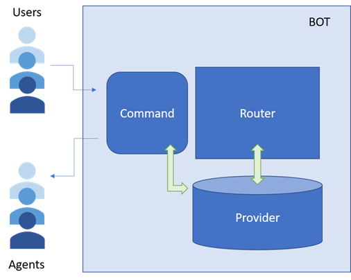
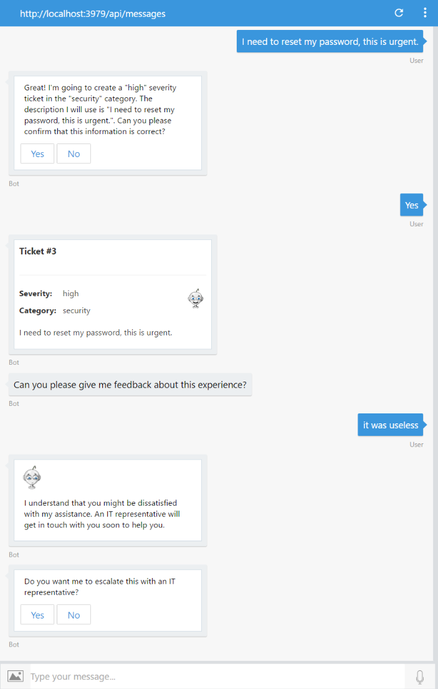
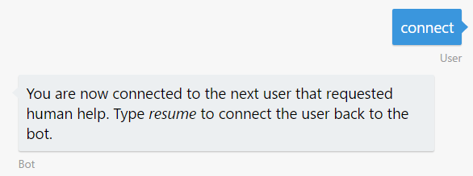
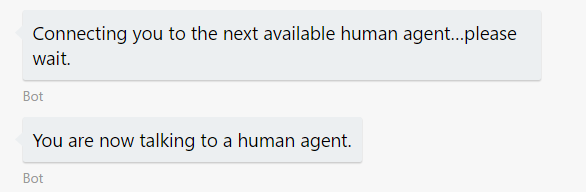
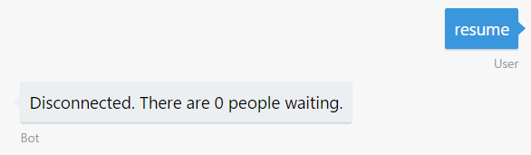
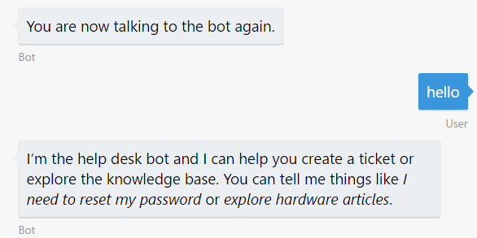

# Exercise 7: Hand off the Conversation to a Human Agent (C#)

## Introduction

Regardless of how much artificial intelligence a bot possesses, there may still be times when it needs to hand off the conversation to a human being. For example you want to build a bot that automatically replies some questions and is able to meet your customers wherever they are, but still be able to escalate issues to a human. Or if the bot couldn't handle every situation, or there were edge cases, the bot should be able to pass off to a person who had the right authority. The bot should recognize when it needs to hand off and provide the user with a clear, smooth transition. In this exercise, you will learn how you can use a bot to initiate a conversation with a user, and then hand off context to a human agent.

First, you will learn how to use `Scorables` to intercepts incoming and outgoing events/messages. With this, you will handle the user-agent communication and the specials command only available for agents. Later you will modify your bot to use the new `Scorables` and add a dialog to hand off the bot conversation to a human agent.

Inside [this folder](./exercise7-HandOffToHuman) you will find a solution with the code that results from completing the steps in this exercise. You can use this solution as guidance if you need additional help as you work through this exercise. Remember that for using it, you first need to complete the keys in Web.config.

For more details about the hand-off approach used in this exercise you can check this session from [BUILD 2017](https://channel9.msdn.com/Events/Build/2017/P4075).

This diagram outlines the components of the bot for this exercise:



## Prerequisites

The following software is required for completing this exercise:

* [Visual Studio 2017 Community](https://www.visualstudio.com/downloads) or higher
* An [Azure](https://azureinfo.microsoft.com/us-freetrial.html?cr_cc=200744395&wt.mc_id=usdx_evan_events_reg_dev_0_iottour_0_0) subscription
* An account in the [LUIS Portal](https://www.luis.ai)
* The [Bot Framework Emulator](https://emulator.botframework.com) (make sure it's configured with the `en-US` Locale)

## Task 1: Build the Hand Off Logic

In this task you will add the necessary _behind-the-scenes_ logic to handle the bridged communication between two persons, one as a user and other as an agent. You will learn how to create and put scorables to intercepts incoming and outgoing events/messages.

The scorables in the Bot Builder SDK for .NET enables your bot to intercept every message sent to a conversation and apply a score to the message based on logic defined by you. To create a Scorable you create a class that implements the `IScorable` interface by inheriting from the `ScorableBase` abstract class. To have that Scorable applied to every message in the conversation, the bot registers that `IScorable` interface as a `Service` with the `Conversation`'s `Container`. When a new message arrives to the `Conversation`, it passes that message to each implementation of `IScorable` in the `Container` to get a score. The `Container` then passes that message to the `IScorable` with the highest score for processing. For more information about `Scorables`, see [this sample](https://github.com/Microsoft/BotBuilder-Samples/tree/master/CSharp/core-GlobalMessageHandlers).

1. Open the app you've obtained from the previous exercise. Alternatively, you can use the app from the [exercise6-MoodDetection](./exercise6-MoodDetection) folder.

    > **NOTE:** If you use the solution provided remember to replace:
    > * the **[LuisModel("{LUISAppID}", "{LUISKey}")]** attribute placeholders in `RootDialog.cs` with your LUIS App Id and Programmatic API Key (as explained in exercise 3)
    > * the **TextAnalyticsApiKey** in `Web.config` with your Text Analytics Key (as explained in exercise 6)
    > * the **AzureSearchAccount** and **AzureSearchKey** in `Web.config` with your search account name and key (as explained in exercise 4)

1. Create a folder `HandOff` in your project and add the following files from the [assets](../assets) folder.

    * [`AgentExtensions.cs`](../assets/exercise7-HandOffToHuman/AgentExtensions.cs)

        Contains a simple logic to convert a normal user to an Agent and to identify an Agent. You can use this to implement your own logic going forward for managing conversations, users and agents.

    * [`Provider.cs`](../assets/exercise7-HandOffToHuman/Provider.cs)

        Builds a queue with the users waiting for a human agent. Notice that this class does not persist the queue in an external storage. This is also where the conversations metadata is stored. If you wanted to store a conversation in a data store, you could either update or inherit from `Provider` with your custom implementation.

    * [`CommandScorable.cs`](../assets/exercise7-HandOffToHuman/CommandScorable.cs)

        This Scorable is reached when the message is from an Agent and only triggers its resolution when receives `agent help`, `connect` or `resume` messages. If the user message doesn't match those it is not processed with this Scorable.

1. Create a `RouterScorable.cs` class in the `HandOff` folder using the following boilerplate code. The router will be in charge of knowing where each message needs to be sent to, either to the agent or the user.

    ```CSharp
    namespace HelpDeskBot.HandOff
    {
        using System;
        using System.Threading;
        using System.Threading.Tasks;
        using Microsoft.Bot.Builder.Dialogs.Internals;
        using Microsoft.Bot.Builder.Internals.Fibers;
        using Microsoft.Bot.Builder.Scorables.Internals;
        using Microsoft.Bot.Connector;

        public class RouterScorable : ScorableBase<IActivity, ConversationReference, double>
        {
            private readonly ConversationReference conversationReference;
            private readonly Provider provider;
            private readonly IBotData botData;

            public RouterScorable(IBotData botData, ConversationReference conversationReference, Provider provider)
            {
                SetField.NotNull(out this.botData, nameof(botData), botData);
                SetField.NotNull(out this.conversationReference, nameof(conversationReference), conversationReference);
                SetField.NotNull(out this.provider, nameof(provider), provider);
            }

            protected override Task DoneAsync(IActivity item, ConversationReference state, CancellationToken token)
            {
                return Task.CompletedTask;
            }
        }
    }
    ```

1. Add the `PrepareAsync`, `PrepareRouteableAgentActivity`, and `PrepareRouteableUserActivity` methods in `RouterScorable.cs`.

    The `PrepareAsync` method receives the incoming message and triggers its resolution by calling some of the other methods.

    ```CSharp
    protected override async Task<ConversationReference> PrepareAsync(IActivity activity, CancellationToken token)
    {
        var message = activity as Activity;

        if (message != null && !string.IsNullOrWhiteSpace(message.Text))
        {
            // determine if the message comes from an agent or user
            if (this.botData.IsAgent())
            {
                return this.PrepareRouteableAgentActivity(message.Conversation.Id);
            }
            else
            {
                return this.PrepareRouteableUserActivity(message.Conversation.Id);
            }
        }

        return null;
    }
    ```

    `PrepareRouteableAgentActivity` triggers the Scorable when the message is from an Agent connected with a normal user.

    ```CSharp
    protected ConversationReference PrepareRouteableAgentActivity(string conversationId)
    {
        var conversation = this.provider.FindByAgentId(conversationId);
        return conversation?.User;
    }
    ```

    `PrepareRouteableUserActivity` triggers the Scorable when the message is from a normal user waiting for an Agent or connected to an Agent.

    ```CSharp
    protected ConversationReference PrepareRouteableUserActivity(string conversationId)
    {
        var conversation = this.provider.FindByConversationId(conversationId);
        if (conversation == null)
        {
            conversation = this.provider.CreateConversation(this.conversationReference);
        }

        switch (conversation.State)
        {
            case ConversationState.ConnectedToBot:
                return null; // continue normal flow
            case ConversationState.WaitingForAgent:
                return conversation.User;
            case ConversationState.ConnectedToAgent:
                return conversation.Agent;
        }

        return null;
    }
    ```

1. Add `HasScore` and `GetScore` methods in `RouterScorable.cs`. `HasScore` is only evaluated when `PrepareAsync` returns a valid `ConversationReference` and `GetScore` returns the maximun score to resolve the message.

    ```CSharp
    protected override bool HasScore(IActivity item, ConversationReference destination)
    {
        return destination != null;
    }

    protected override double GetScore(IActivity item, ConversationReference destination)
    {
        return 1.0;
    }
    ```

1. Add a `PostAsync` method in `RouterScorable.cs`. If this Scorable won the resolution of the message the `ConversationReference` receives the destination of the message. If the destination is the same user of the current conversation the Scorable sends a message to the user informing the status of the queue, in any other case the Scorable routes the incoming message to the destination.

    ```CSharp
    protected override async Task PostAsync(IActivity item, ConversationReference destination, CancellationToken token)
    {
        string textToReply;
        if (destination.Conversation.Id == conversationReference.Conversation.Id)
        {
            textToReply = "Connecting you to the next available human agent... please wait";
        }
        else
        {
            textToReply = item.AsMessageActivity().Text;
        }

        ConnectorClient connector = new ConnectorClient(new Uri(destination.ServiceUrl));
        var reply = destination.GetPostToUserMessage();
        reply.Text = textToReply;
        await connector.Conversations.SendToConversationAsync(reply);
    }
    ```

## Task 2: Update the Bot to Hand off the Conversation

In this task you will update the bot to connect to the routing Scorables and add the necessary dialogs to handle the handoff conversation flow.

1. Open the [LUIS Portal](https://www.luis.ai) and edit your app to add a **HandOffToHuman** intent with the following utterances:
    * _I want to talk to an IT representative_
    * _Contact me to a human being_
    * _Operator_

    If you prefer, you can import and use [this LUIS model](../assets/exercise7-HandOffToHuman/luis_model.json).

1. Train and publish your app again.

1. Copy [`AgentLoginScorable.cs`](../assets/exercise7-HandOffToHuman/AgentLoginScorable.cs) from the [assets](../assets) folder to the `Dialogs` folder. This class manages the switching between normal users and human agents.

1. Open `Global.asax.cs` and add the following using statement.

    ```csharp
    using HandOff;
    using Microsoft.Bot.Builder.Dialogs.Internals;
    ```

1. In `Global.asax.cs` add the registration of the new `IScorable`'s implementations to handle the communication between two users.

    ```csharp
    protected void Application_Start()
    {
        GlobalConfiguration.Configure(WebApiConfig.Register);

        var builder = new ContainerBuilder();

        // Hand Off Scorables, Provider and UserRoleResolver
        builder.Register(c => new RouterScorable(c.Resolve<IBotData>(), c.Resolve<ConversationReference>(), c.Resolve<Provider>()))
            .As<IScorable<IActivity, double>>().InstancePerLifetimeScope();
        builder.Register(c => new CommandScorable(c.Resolve<IBotData>(), c.Resolve<ConversationReference>(), c.Resolve<Provider>()))
            .As<IScorable<IActivity, double>>().InstancePerLifetimeScope();
        builder.RegisterType<Provider>()
            .SingleInstance();

        // Bot Scorables
        builder.Register(c => new AgentLoginScorable(c.Resolve<IBotData>(), c.Resolve<Provider>()))
            .As<IScorable<IActivity, double>>()
            .InstancePerLifetimeScope();
        builder.RegisterType<SearchScorable>()
            .As<IScorable<IActivity, double>>()
            .InstancePerLifetimeScope();
        builder.RegisterType<ShowArticleDetailsScorable>()
            .As<IScorable<IActivity, double>>()
            .InstancePerLifetimeScope();

        builder.Update(Microsoft.Bot.Builder.Dialogs.Conversation.Container);
    }
    ```

1. In `RootDialog.cs` add a `HandOff` method to handle the HandOffToHuman intent and put the user in the queue to talk to an agent.

    ```CSharp
    [LuisIntent("HandOffToHuman")]
    public async Task HandOff(IDialogContext context, LuisResult result)
    {
        var conversationReference = context.Activity.ToConversationReference();
        var provider = Conversation.Container.Resolve<HandOff.Provider>();

        if (provider.QueueMe(conversationReference))
        {
            var waitingPeople = provider.Pending() > 1 ? $", there are { provider.Pending() - 1 } users waiting" : string.Empty;

            await context.PostAsync($"Connecting you to the next available human agent... please wait{waitingPeople}.");
        }

        context.Done<object>(null);
    }
    ```

1. Also add the following using statement.

    ```csharp
    using Autofac;
    using Microsoft.Bot.Builder.ConnectorEx;
    ```

1. In `UserFeedbackRequestDialog.cs` update the `MessageReceivedAsync` method to call the Handoff dialog created in the previous step if the user satisfaction score is below 0.5. For simplcity, you can replace the full method with the following code (two methods).

    ```CSharp
    public async Task MessageReceivedAsync(IDialogContext context, IAwaitable<string> result)
    {
        var response = await result;

        double score = await this.textAnalyticsService.Sentiment(response);

        if (score == double.NaN)
        {
            await context.PostAsync("Ooops! Something went wrong while analying your answer. An IT representative agent will get in touch with you to follow up soon.");
        }
        else
        {
            string cardText = string.Empty;
            string cardImageUrl = string.Empty;

            if (score < 0.5)
            {
                cardText = "I understand that you might be dissatisfied with my assistance. An IT representative will get in touch with you soon to help you.";
                cardImageUrl = "https://raw.githubusercontent.com/GeekTrainer/help-desk-bot-lab/master/assets/botimages/head-sad-small.png";
            }
            else
            {
                cardText = "Thanks for sharing your experience.";
                cardImageUrl = "https://raw.githubusercontent.com/GeekTrainer/help-desk-bot-lab/master/assets/botimages/head-smiling-small.png";
            }

            var msg = context.MakeMessage();
            msg.Attachments = new List<Attachment>
            {
                new HeroCard
                {
                    Text = cardText,
                    Images = new List<CardImage>
                    {
                        new CardImage(cardImageUrl)
                    }
                }.ToAttachment()
            };
            await context.PostAsync(msg);

            if (score < 0.5)
            {
                var text = "Do you want me to escalate this with an IT representative?";
                PromptDialog.Confirm(context, this.EscalateWithHumanAgent, text);
            }
            else
            {
                context.Done<object>(null);
            }
        }
    }

    private async Task EscalateWithHumanAgent(IDialogContext context, IAwaitable<bool> argument)
    {
        var confirmed = await argument;

        if (confirmed)
        {
            var conversationReference = context.Activity.ToConversationReference();
            var provider = Conversation.Container.Resolve<HandOff.Provider>();

            if (provider.QueueMe(conversationReference))
            {
                var waitingPeople = provider.Pending() > 1 ? $", there are { provider.Pending() - 1 } users waiting" : string.Empty;

                await context.PostAsync($"Connecting you to the next available human agent... please wait{waitingPeople}.");
            }

        }

        context.Done<object>(null);
    }
    ```

1. Also add the following using statement.

    ```csharp
    using Autofac;
    using Microsoft.Bot.Builder.ConnectorEx;
    ```

## Task 3: Test the Bot from the Emulator

1. Run the app clicking in the **Run** button and open two instances of the emulator. Type the bot URL as usual (`http://localhost:3979/api/messages`) in both.

1. In one emulator type `I need to reset my password, this is urgent` to create a new ticket and confirm the submission. When the bot asks for feedback, type a negative phrase like `it was useless`. You should see a new prompt asking you if you want to talk with an agent.

    

1. Confirm the prompt to send the user to the queue of users waiting.

    

1. Now, in the second emulator type `/agent login` to take control of the agent privileges. The bot should inform you that there is one user waiting. If you type `agent help` you should see a message with the agent's options.

    

1. Type `connect` to begin the conversation with the user. Note that in the first emulator the bot will inform the user of this connection.

    | Agent messages | User messages |
    |---|---|
    |||

1. Now you can play with the emulators and see the communication between agent and user.

    | Agent messages | User messages |
    |---|---|
    |  |  |

1. In order to finish the interaction type `resume` in the second emulator (the agent emulator) and the bot should inform to both participants the end of the communication.

    | Agent messages | User messages |
    |---|---|
    |||

    > **NOTE:** Another possible scenario is "supervised hand off". In this case, depending on the user question, the bot might contact a human agent asking which one of the possible answers the bot has prepared is the correct one.

## Further Challenges

If you want to continue working on your own you can try with these tasks:

* Create a custom provider to store conversation data in an external data store, such as Cosmos DB or SQL Server.
* Add authentication for `AgentLoginScorable`. You would need to add a [Sign-inCard](https://docs.botframework.com/en-us/csharp/builder/sdkreference/dc/d03/class_microsoft_1_1_bot_1_1_connector_1_1_signin_card.html) to invoke your user's authentication process.
* Modify the [`Provider.cs`](../assets/exercise7-HandOffToHuman/Provider.cs) to add conversation data persistence. As it is now, the active conversations are stored in-memory and it's difficult to scale the bot.
* You could implement a new state in the router for watching the conversation. In this case, the user and bot messages are sent to the human agent for him to monitor.
* When the bot is waiting for a human, it will automatically answer all incoming user messages with a default response. You could have the bot remove the conversation from the "waiting" state if the user sent certain messages such as _"never mind"_ or _"cancel"_.
* Another alternative for hand-off would be to add a button in the help dialog that hands-off the conversation to a human.
