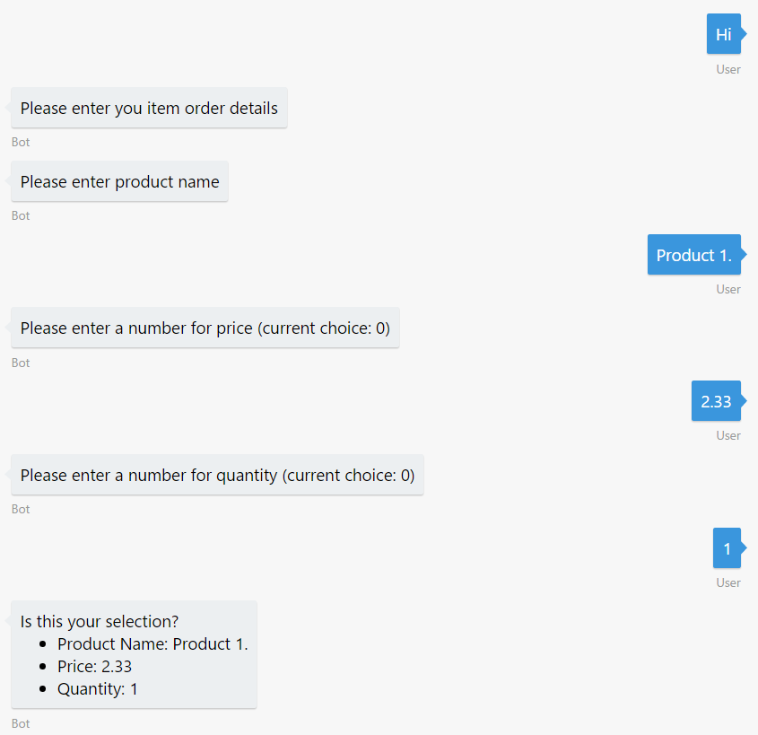

# Sample Demo Code (C#)

### Text Prompts

In the `StartAsync` method of this dialog, we ask the user to describe his problem and it sends the response to the `MessageReceivedAsync` method in which we print it.

``` csharp
[Serializable]
public class RootDialog : IDialog<object>
{
    public Task StartAsync(IDialogContext context)
    {
        PromptDialog.Text(context, this.MessageReceivedAsync, "First, please briefly describe your problem to me.");

        return Task.CompletedTask;
    }

    public async Task MessageReceivedAsync(IDialogContext context, IAwaitable<string> argument)
    {
        var description = await argument;
        Console.WriteLine(description);
    }
}
```

### Choice, confirm, buttons in cards

In the `StartAsync` method of this dialog, we ask the user to choose from a closed list the severity and it sends the response to the `MessageReceivedAsync` method in which we print it.

``` csharp
[Serializable]
public class RootDialog : IDialog<object>
{
    public async Task StartAsync(IDialogContext context)
    {
        var severities = new string[] { "high", "normal", "low" };
        PromptDialog.Choice(context, this.MessageReceivedAsync, severities, "Which is the severity of this problem?");
    }

    public async Task MessageReceivedAsync(IDialogContext context, IAwaitable<string> argument)
    {
        var severity = await argument;
        Console.WriteLine(severity);
    }
}
```

This code prompts the user for confirmation, expecting a yes/no answer.

``` csharp
[Serializable]
public class RootDialog : IDialog<object>
{
    public async Task StartAsync(IDialogContext context)
    {
        PromptDialog.Confirm(context, this.MessageReceivedAsync, "Are you sure this is correct?");
    }

    public async Task MessageReceivedAsync(IDialogContext context, IAwaitable<bool> argument)
    {
        var confirmed = await argument;
        Console.WriteLine(confirmed);
    }
}
```

### Scorables

In this sample, we will handle the `help` global message and display a message to the user.

First, create a class implementing the **ScorableBase** base class.

``` csharp
using System;
using System.Threading;
using System.Threading.Tasks;
using Microsoft.Bot.Builder.Scorables.Internals;
using Microsoft.Bot.Connector;

public class HelpScorable : ScorableBase<IActivity, string, double>
{
    protected override Task DoneAsync(IActivity item, string state, CancellationToken token)
    {
        return Task.CompletedTask;
    }

    protected override double GetScore(IActivity item, string state)
    {
        return 1.0;
    }

    protected override bool HasScore(IActivity item, string state)
    {
        return !string.IsNullOrWhiteSpace(state);
    }

    protected override async Task PostAsync(IActivity item, string state, CancellationToken token)
    {
        ConnectorClient connector = new ConnectorClient(new Uri(item.ServiceUrl));

        var replyActivity = ((Activity)item).CreateReply("I'm the help desk bot and I can help you create a ticket.\nYou can tell me things like _I need to reset my password_ or _I cannot print_.");
        await connector.Conversations.ReplyToActivityAsync(replyActivity);
    }

    protected override async Task<string> PrepareAsync(IActivity activity, CancellationToken token)
    {
        if (activity is IMessageActivity message && !string.IsNullOrWhiteSpace(message.Text))
        {
            if (message.Text.Equals("help", StringComparison.InvariantCultureIgnoreCase))
            {
                return message.Text;
            }
        }
        return null;
    }
}
```

Next, register the new class in **Autofac** container in the `Global.asax` file.

``` csharp
using System.Web.Http;
using Autofac;
using Dialogs;
using Microsoft.Bot.Builder.Scorables;
using Microsoft.Bot.Connector;

public class WebApiApplication : System.Web.HttpApplication
{
    protected void Application_Start()
    {
        GlobalConfiguration.Configure(WebApiConfig.Register);

        var builder = new ContainerBuilder();

        builder
            .Register(c => new HelpScorable())
            .As<IScorable<IActivity, double>>()
            .InstancePerLifetimeScope();

        builder.Update(Microsoft.Bot.Builder.Dialogs.Conversation.Container);
    }
}
```

More info [here](https://docs.microsoft.com/en-us/bot-framework/dotnet/bot-builder-dotnet-global-handlers) about scorables.

### Create an Adaptive Card

To be able to send AdaptiveCard, you must use the `Microsoft.AdaptiveCards` NuGet package.

``` csharp
var message = context.MakeMessage();
message.Attachments = new List<Attachment>
{
    new Attachment
    {
        ContentType = "application/vnd.microsoft.card.adaptive",
        Content = this.CreateCard()
    }
};

await context.PostAsync(message);
```

``` csharp
using AdaptiveCards;
using System.Collections.Generic;

private AdaptiveCard CreateCard(int ticketId, string category, string severity, string description)
{
    var card = new AdaptiveCard();

    var headerBlock = new TextBlock()
    {
        Text = $"Ticket #1",
        Weight = TextWeight.Bolder,
        Size = TextSize.Large
    };

    var columnsBlock = new ColumnSet()
    {
        Separation = SeparationStyle.Strong,
        Columns = new List<Column>
        {
            new Column
            {
                Size = "1",
                Items = new List<AdaptiveCards.CardElement>
                {
                    new FactSet
                    {
                        Facts = new List<AdaptiveCards.Fact>
                        {
                            new AdaptiveCards.Fact("Severity:", "High"),
                            new AdaptiveCards.Fact("Category:", "Software"),
                        }
                    }
                }
            },
            new Column
            {
                Size = "auto",
                Items = new List<CardElement>
                {
                    new AdaptiveCards.Image
                    {
                        Url = "https://raw.githubusercontent.com/GeekTrainer/help-desk-bot-lab/master/assets/botimages/head-smiling-medium.png",
                        Size = ImageSize.Small,
                        HorizontalAlignment = HorizontalAlignment.Right
                    }
                }
            }
        }
    };

    card.Body.Add(headerBlock);
    card.Body.Add(columnsBlock);

    return card;
}
```

### Middleware

To intercept messages and log them using a _middleware_, you can implement the `IActivityLogger` interface and in the `LogAsync` method do what you need. This method is called whenever the user or the bot send a message.

``` csharp
using System.Threading.Tasks;
using Microsoft.Bot.Builder.History;
using Microsoft.Bot.Connector;

public class DebugActivityLogger : IActivityLogger
{
    public async Task LogAsync(IActivity activity)
    {
        Debug.WriteLine($"From:{activity.From.Id} - To:{activity.Recipient.Id} - Message:{activity.AsMessageActivity()?.Text}");
    }
}
```

Next, register the new class in **Autofac** container in the `Global.asax` file.

``` csharp
using System.Web.Http;
using Autofac;

public class WebApiApplication : System.Web.HttpApplication
{
    protected void Application_Start()
    {
        GlobalConfiguration.Configure(WebApiConfig.Register);

        var builder = new ContainerBuilder();

        builder
            .RegisterType<DebugActivityLogger>()
            .AsImplementedInterfaces()
            .InstancePerDependency();

        builder.Update(Microsoft.Bot.Builder.Dialogs.Conversation.Container);
    }
}
```

### Send Typing Indicator

In this sample, we simulate a long running task with the `Thread.Sleep` function and send to the user the `ActivityTypes.Typing` message type to let him know we are processing the request.

``` csharp
[Serializable]
public class RootDialog : IDialog<object>
{
    public Task StartAsync(IDialogContext context)
    {
        context.Wait(MessageReceivedAsync);

        return Task.CompletedTask;
    }

    private async Task MessageReceivedAsync(IDialogContext context, IAwaitable<object> result)
    {
        var message = context.MakeMessage();
        message.Type = ActivityTypes.Typing;
        await context.PostAsync(message);

        Thread.Sleep(1000);

        var activity = await result as Activity;

        // calculate something for us to return
        int length = (activity.Text ?? string.Empty).Length;

        // return our reply to the user
        await context.PostAsync($"You sent {activity.Text} which was {length} characters");

        context.Wait(MessageReceivedAsync);
    }
}
```

### Proactive Messages

To send proactive messages, we will need a class to store the conversation data from outside the dialog flow. The `SendMessageAsync` method takes the properties, creates a message and send it to the user.

``` csharp
internal class ConversationData
{
    public string ToId { get; internal set; }
    public string ToName { get; internal set; }
    public string FromId { get; internal set; }
    public string FromName { get; internal set; }
    public string ServiceUrl { get; internal set; }
    public string ChannelId { get; internal set; }
    public string ConversationId { get; internal set; }
    public string Message { get; internal set; }

    internal async Task SendMessageAsync()
    {
        var userAccount = new ChannelAccount(this.ToId, this.ToName);
        var botAccount = new ChannelAccount(this.FromId, this.FromName);
        var connector = new ConnectorClient(new Uri(this.ServiceUrl));

        IMessageActivity message = Activity.CreateMessageActivity();
        if (!string.IsNullOrEmpty(this.ConversationId) && !string.IsNullOrEmpty(this.ChannelId))
        {
            message.ChannelId = this.ChannelId;
        }
        else
        {
            this.ConversationId = (await connector.Conversations.CreateDirectConversationAsync(botAccount, userAccount)).Id;
        }
        message.From = botAccount;
        message.Recipient = userAccount;
        message.Conversation = new ConversationAccount(id: this.ConversationId);
        message.Text = this.Message;
        message.Locale = "en-Us";
        await connector.Conversations.SendToConversationAsync((Activity)message);
    }
}
```

To simulate the proactive scenario, we will store the length of the message the user sent and when she is idle for 10 seconds we will inform the total length. In the `MessageReceivedAsync` method we set the object data and a `Timer` that will call the `TimerEvent` method when the specified time is reached. More info about Proactive message [here](https://docs.microsoft.com/en-us/bot-framework/dotnet/bot-builder-dotnet-proactive-messages).

``` csharp
using System;
using System.Threading;
using System.Threading.Tasks;
using Microsoft.Bot.Builder.Dialogs;
using Microsoft.Bot.Connector;

[Serializable]
public class RootDialog : IDialog<object>
{
    private int CharLength = 0;

    [NonSerialized]
    private static Timer timer;

    public Task StartAsync(IDialogContext context)
    {
        context.Wait(MessageReceivedAsync);

        return Task.CompletedTask;
    }

    private async Task MessageReceivedAsync(IDialogContext context, IAwaitable<object> result)
    {
        var activity = await result as Activity;

        // calculate something for us to return
        int length = (activity.Text ?? string.Empty).Length;

        this.CharLength += length;

        var data = new ConversationData()
        {
            ToId = activity.From.Id,
            ToName = activity.From.Name,
            FromId = activity.Recipient.Id,
            FromName = activity.Recipient.Name,
            ServiceUrl = activity.ServiceUrl,
            ChannelId = activity.ChannelId,
            ConversationId = activity.Conversation.Id,
            Message = $"You have send {CharLength} characters so far."
        };

        // return our reply to the user
        await context.PostAsync($"You sent {activity.Text} which was {length} characters");

        if (timer != null)
        {
            //Cancel the existing timer.
            timer.Change(Timeout.Infinite, Timeout.Infinite);
        }

        //We create a timer to simulate some background process or trigger
        timer = new Timer(new TimerCallback(TimerEvent), data, 10000, Timeout.Infinite);

        context.Wait(MessageReceivedAsync);
    }

    private void TimerEvent(object state)
    {
        timer.Change(Timeout.Infinite, Timeout.Infinite);
        var data = (ConversationData)state;
        data.SendMessageAsync();
    }
}
```

### Cortana Skill

You can interact with **Cortana**. You need to enable **Cortana Channel** in your bot in Bot Framework portal as described [here](https://docs.microsoft.com/en-us/bot-framework/debug-bots-cortana-skill-invoke#test-your-cortana-skill). In the following code, we use the `SayAsync` method instead `PostAsync`. This methods are similar but first one accepts a second parameter that is what the bot will speak. This parameter may be a SSML XML string to enrich the user experience.

More info about _Build a speech-enabled bot with Cortana skills_ can be found [here](https://docs.microsoft.com/en-us/bot-framework/dotnet/bot-builder-dotnet-cortana-skill).

``` csharp
[Serializable]
public class RootDialog : IDialog<object>
{
    public Task StartAsync(IDialogContext context)
    {
        context.Wait(MessageReceivedAsync);

        return Task.CompletedTask;
    }

    private async Task MessageReceivedAsync(IDialogContext context, IAwaitable<object> result)
    {
        var activity = await result as Activity;

        // calculate something for us to return
        int length = (activity.Text ?? string.Empty).Length;

        // return our reply to the user
        await context.SayAsync($"You sent _{activity.Text}_ which was _{length}_ characters",
                                $"You sent {activity.Text} which was {length} characters");

        context.Wait(MessageReceivedAsync);
    }
}
```

### UserData

This sample shows how to store and retrieve data for the same user in the same channel. In the `MessageReceivedAsync` method we call `TryGetValue` to get the user name. If the user didn't entered it yet, we prompt him to enter it. Otherwise, we salute the user because we have her user name.

``` csharp
using System;
using System.Threading.Tasks;
using Microsoft.Bot.Builder.Dialogs;
using Microsoft.Bot.Connector;

[Serializable]
public class RootDialog : IDialog<object>
{
    public Task StartAsync(IDialogContext context)
    {
        context.Wait(MessageReceivedAsync);

        return Task.CompletedTask;
    }

    private async Task MessageReceivedAsync(IDialogContext context, IAwaitable<object> result)
    {
        var activity = await result as Activity;

        if (!context.UserData.TryGetValue<string>("UserName", out string userName))
        {
            PromptDialog.Text(context, UserNameReceivedAsync, "Please, tell me your name. I will remember.");
            return;
        }

        await context.PostAsync($"Hi, {userName}");

        context.Wait(MessageReceivedAsync);
    }

    private async Task UserNameReceivedAsync(IDialogContext context, IAwaitable<string> result)
    {
        var userName = await result;

        context.UserData.SetValue<string>("UserName", userName);

        context.PostAsync("Ok, I will remember.");

        context.Wait(MessageReceivedAsync);
    }
}
```

### FormFlow

Given a class, we can build a dialog to request the user to fill it.

This is the class. Note the `BuildForm` static method that build the Form Dialog.

``` csharp
using System;
using Microsoft.Bot.Builder.FormFlow;

[Serializable]
public class ItemOrder
{
    public string ProductName { get; set; }
    public double Price { get; set; }
    public int Quantity { get; set; }

    public static IForm<ItemOrder> BuildForm()
    {
        return new FormBuilder<ItemOrder>()
            .Message("Please enter you item order details")
            .Build();
    }
}
```

In the MessageController, we can call it as follows:

``` csharp
[BotAuthentication]
public class MessagesController : ApiController
{
    public async Task<HttpResponseMessage> Post([FromBody]Activity activity)
    {
        if (activity.Type == ActivityTypes.Message)
        {
            //await Conversation.SendAsync(activity, () => new Dialogs.RootDialog());
            await Conversation.SendAsync(activity, () => FormDialog.FromForm(ItemOrder.BuildForm));
        }
        else
        {
            HandleSystemMessage(activity);
        }
        var response = Request.CreateResponse(HttpStatusCode.OK);
        return response;
    }

    ...
}
```

The result dialog may look like this:



[Here](https://docs.microsoft.com/en-us/bot-framework/dotnet/bot-builder-dotnet-formflow) you can find more information about **FormFlow**.