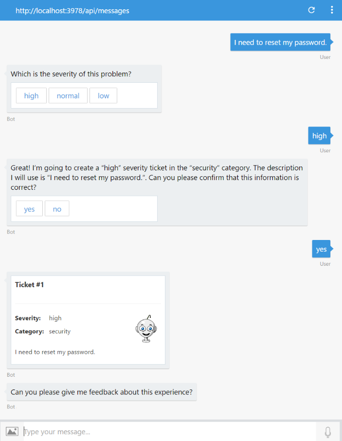

# Exercise 6: Determine the Sentiments Behind a User's Message (Node.js)

## Introduction

The interaction between users and bots is mostly free-form, so bots need to understand language naturally and contextually. In this exercise you will learn how to detect the user's sentiments and mood using the Azure Text Analytics API.

With [Text Analytics APIs](https://azure.microsoft.com/en-us/services/cognitive-services/text-analytics/), part of the Azure Cognitive Services offering, you can detect sentiment, key phrases, topics, and language from your text. The API returns a numeric score between 0 and 1. Scores close to 1 indicate positive sentiment and scores close to 0 indicate negative sentiment. Sentiment score is generated using classification techniques.

Inside [this folder](./exercise6-MoodDetection) you will find a solution with the code that results from completing the steps in this exercise. You can use this solutions as guidance if you need additional help as you work through this exercise. Remember that for using it, you first need to run `npm install` and complete the value of the Text Analytics key in the `.env` file.

## Prerequisites

The following software is required for completing this exercise:

* [Latest Node.js with NPM](https://nodejs.org/en/download)
* A code editor like [Visual Studio Code](https://code.visualstudio.com/download) (preferred), or Visual Studio 2017 Community or higher
* An [Azure](https://azureinfo.microsoft.com/us-freetrial.html?cr_cc=200744395&wt.mc_id=usdx_evan_events_reg_dev_0_iottour_0_0) subscription
* The [Bot Framework Emulator](https://emulator.botframework.com) (make sure it's configured with the `en-US` Locale)

## Task 1: Create the Text Analytics API Key

In this task you will create a Text Analytics Account.

1. Browse [here](https://azure.microsoft.com/en-us/try/cognitive-services/), select the **Language** tab. Find the *Text Analytics API* and click **Create**. You will be prompted to agree the terms of use and choose your country, next click **Next**.

1. Log in with your Azure Subscription account. You should be taken to a page like the following one with an evaluation key with 5000 free requests per month. Save one of the keys for later.

    

## Task 2: Add the Text Analytics API Client

In this task you will create a new module to call the Text Analytics API from the bot.

1. Open the app you've obtained from the previous exercise. Alternatively, you can use the app from the [exercise4-LuisDialog](./exercise4-KnowledgeBase) folder.

    > **NOTE:** If you use the solution provided edit the `.env` file and replace:
    > * the **LUIS\_MODEL\_URL** key with your model URL (as explained in exercise 3)
    > * the **AZURE\_SEARCH\_INDEX** and **AZURE\_SEARCH\_KEY** with your search index name and key (as explained in exercise 4)

1. Create a new file named `textAnalyticsApiClient.js` and add the following code to it.

    > **NOTE:** Notice that the client is hitting the `/sentiment` endpoint. The Text Analytics API also provides the `/keyPhrases` and `/languages` endpoints. Also notice that you can send more than one document to analyze.

    ```javascript
    const restify = require('restify');

    module.exports = (config) => {
        return (query, callback) => {
            const client = restify.createJsonClient({
                url: `https://westus.api.cognitive.microsoft.com`,
                headers: {
                    'Ocp-Apim-Subscription-Key': config.apiKey
                }
            });

            const payload = {
                documents: [{
                    language: 'en',
                    id: 'singleId',
                    text: query
                }]
            };

            const urlPath = '/text/analytics/v2.0/sentiment';

            client.post(urlPath, payload, (err, request, response, result) => {
                if (!err &&
                    response &&
                    response.statusCode == 200 &&
                    result.documents[0]) {
                    callback(null, result.documents[0].score);
                } else {
                    callback(err, null);
                }
            });
        };
    };
    ```

## Task 3: Modify the Bot to Ask for Feedback and Analyze the User's Sentiments

In this task you will introduce the new Text Analytics module and then consume it from a new dialog on your bot.

1. Update the `.env` file adding the following line, replace the *TEXT\_ANALYTICS\_KEY* key with the *Text Analytics Key* you have obtained in Task 1.

    ```bash
    TEXT_ANALYTICS_KEY=
    ```

1. Open the **app.js** file.

1. Add the following code.

    ```javascript
    const textAnalytics = require('./textAnalyticsApiClient');
    ```

1. Add the following code.

    ```javascript
    const analyzeText = textAnalytics({
        apiKey: process.env.TEXT_ANALYTICS_KEY
    });
    ```

1. At the end of the file, add the following code that creates a new dialog to ask the user for feedback and call the *Text Analytics API* client to evaluate the user sentiments. Depending on the response (greater or lower than 0.5) a different message is displayed to the user.

    ```javascript
    bot.dialog('UserFeedbackRequest', [
        (session, args) => {
            builder.Prompts.text(session, 'Can you please give me feedback about this experience?');
        },
        (session, response) => {
            const answer = session.message.text;
            analyzeText(answer, (err, score) => {
                if (err) {
                    session.endDialog('Ooops! Something went wrong while analzying your answer. An IT representative agent will get in touch with you to follow up soon.');
                } else {
                    var msg = new builder.Message(session);
                    var cardImageUrl, cardText;

                    // 1 - positive feeling / 0 - negative feeling
                    if (score < 0.5) {
                        cardText = 'I understand that you might be dissatisfied with my assistance. An IT representative will get in touch with you soon to help you.';
                        cardImageUrl = 'https://raw.githubusercontent.com/GeekTrainer/help-desk-bot-lab/develop/assets/botimages/head-sad-small.png';
                    } else {
                        cardText = 'Thanks for sharing your experience.';
                        cardImageUrl = 'https://raw.githubusercontent.com/GeekTrainer/help-desk-bot-lab/develop/assets/botimages/head-smiling-small.png';
                    }

                    msg.addAttachment(
                        new builder.HeroCard(session)
                            .text(cardText)
                            .images([builder.CardImage.create(session, cardImageUrl)])
                    );

                    session.endDialog(msg);
                }
            });
        }
    ]);
    ```

    > **NOTE:** For sentiment analysis, it's recommended that you split text into sentences. This generally leads to higher precision in sentiment predictions.

1. Update the last waterfall step for the **SubmitTicket** dialog. Replace the `session.endDialog();` in the following code:

    ```javascript
    (session, result, next) => {
        if (result.response) {
            ...

            client.post('/api/tickets', data, (err, request, response, ticketId) => {
                ...

                session.endDialog();
            });
        } else {
          ...
        }
    }
    ```

    with the this code, which calls the `UserFeedbackRequest` dialog.

    ```javascript
    session.replaceDialog('UserFeedbackRequest');
    ```

## Task 4: Test the Bot from the Emulator

1. Run the app from a console (`nodemon app.js`) and open the emulator. Type the bot URL as usual (`http://localhost:3978/api/messages`).

1. Type `I need to reset my password` and next choose a severity. Confirm the ticket submission, and check the new request for feedback.

    

1. Type `It was very useful and quick`. You should see the following response, which means it was a positive feedback.

    

1. Repeat the ticket submission and when the bot asks for feedback, type `it was useless and time wasting`. You should see a response as follows, which means it was a a negative experience.

    

    In the next exercise (7) you will learn how to hand-off the conversation to a human so he can assist the user.

## Further Challenges

If you want to continue working on your own you can try with these tasks:

* You can add Speech Recognition to the bot by using another Microsoft Cognitive Services. You can try the [Bing Speech API](https://azure.microsoft.com/en-us/services/cognitive-services/speech/).
