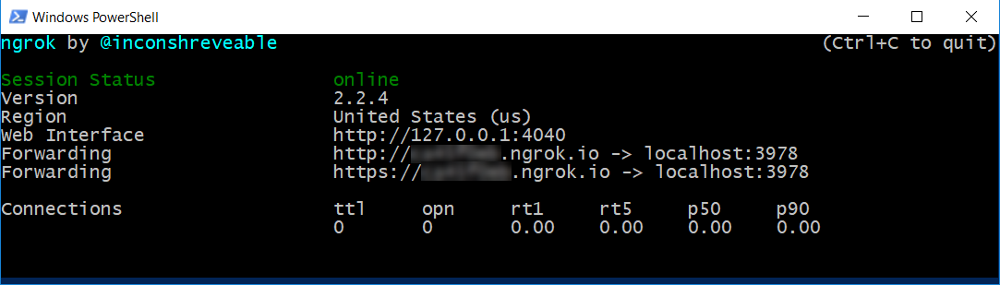

# Exercise 8: Send and Receive Events Through a Backchannel (Node.js)

## Introduction

The backchannel mechanism allows a client app and the bot to exchange information that is invisible to the user. Examples of this could be from requesting the client's time zone to reading a GPS location or what the user is doing on a web page. The bot can even guide the user by automatically filling out parts of a web form and so on. The backchannel closes the gap between JavaScript client apps and bots. This mechanism is implemented by using the Direct Line API, which allows activities to be sent back and forth between the client and the bot.

In this exercise, you will add a Web Page to your app. The bot and web page will use the backchannel mechanism to communicate. The bot will send the user's ticket to the web page, which will display related KB articles for that ticket. The goal would be that a human supervisor agent can monitor the conversation and by using the web page decide if there is an article that can help the user and avoid the creation of a ticket. If he finds an article, the supervisor agent can click it to display it in the user conversation with the bot.

The Bot Framework documentation contains more information about [how backchannel works](https://docs.microsoft.com/en-us/bot-framework/nodejs/bot-builder-nodejs-backchannel).

Inside [this folder](./exercise8-BackChannel) you will find a solution with the code that results from completing the steps in this exercise. You can use this solutions as guidance if you need additional help as you work through this exercise. Remember that for using it, you first need to run `npm install` and complete the values in the `.env` file. Also, you need to replace the `{DIRECTLINE_SECRET}` and `{BOT_ID}` placeholders in [web-ui\default.htm](./exercise8-BackChannel/web-ui/default.htm).

This diagram outlines the components of this exercise:


## Prerequisites

The following software is required for completing this exercise:

* [Latest Node.js with NPM](https://nodejs.org/en/download/)
* A code editor like [Visual Studio Code](https://code.visualstudio.com/download) (preferred), or Visual Studio 2017 Community or higher
* The [Bot Framework Emulator](https://emulator.botframework.com) (make sure it's configured with the `en-US` Locale)
* [ngrok](https://ngrok.com/) for local development.

## Task 1: Add a New Site to Your Bot's Web Chat Channel

1. Sign in to the [Bot Framework Portal](https://dev.botframework.com).

1. Click the **My bots** button and click on your bot for editing it.

    > **NOTE:** This exercise assumes that you have already registered your bot in the Bot Framework Portal. If you didn't you can find instructions in [Exercise 5](./exercise5-Deployment.md).

1. Click on the **Edit** () link for the _Web Chat_ channel. In the opened window, click **Add new site**. Type a _site name_ (for example, _Help Desk Ticket Search_).

    

1. Click **Done** and you should see the following page. Notice that you have two **Secret Keys**. Save one of them for later. Click **Done**.

    

## Task 2: Add an HTML Page with an Embedded Web Chat

In this task you will add a HTML page to your app which contains the web chat control and the code to send/receive `event` messages to your bot. Next, you will add the BackChannel capability to send `event` activities from your bot to the Web Page.

1. Open the app you've obtained from the previous exercise. Alternatively, you can use the app from the [exercise7-HandOffToHuman](./exercise7-HandOffToHuman) folder.

    > **NOTE:** If you use the solution provided remember to replace in `.env`:
    > * the **MICROSOFT\_APP\_ID** and **MICROSOFT\_APP\_PASSWORD** with your Bot Framework App ID and Password (as explained in exercise 5)
    > * the **LUIS\_MODEL\_URL** value with your LUIS model URL (as explained in exercise 3)
    > * the **TEXT\_ANALYTICS\_KEY** with your Text Analytics Key (as explained in exercise 6)
    > * the **AZURE\_SEARCH\_ACCOUNT** and **AZURE\_SEARCH\_KEY** with your search index name and key (as explained in exercise 4)
    > * the **MICROSOFT\_APP\_ID** and **MICROSOFT\_APP\_PASSWORD** with your Bot values from the Bot Framework Portal

1. Create a new folder named `web-ui` in the root folder for your solution. In that folder, copy the [default.htm](../assets/exercise8-BackChannel/default.htm) file from the [assets](../assets) folder.

1. Below the [`botchat.js` script element](../assets/exercise8-BackChannel/default.htm#L52) add a new script element with the following code which creates a **DirectLine** object with the Web Channel Secret, and registers the WebChat control on the page. Replace the `{DIRECTLINE_SECRET}` placeholder with your Secret Key previously obtained and the `{BOT_ID}` placeholder with the bot handle ID (eg. _help-desk-bot_).

    ``` html
    <script>
        var botConnection = new BotChat.DirectLine({
            secret: '{DIRECTLINE_SECRET}'
        });
        var resPanel = document.getElementById('results');

        BotChat.App({
            botConnection: botConnection,
            user: { id: 'WebChatUser' },
            bot: { id: '{BOT_ID}' },
            locale: 'en-us',
        }, document.getElementById('bot'));
    </script>
    ```

    > **NOTE:** The [open source Web Chat Control](https://github.com/Microsoft/BotFramework-WebChat) communicates with bots by using the [Direct Line API](https://docs.botframework.com/en-us/restapi/directline3/#navtitle), which allows `activities` to be sent back and forth between client and bot. The most common type of activity is `message`, but there are other types as well. For example, the activity type `typing` indicates that a user is typing or that the bot is working to compile a response.

1. In the same script element, add a bot activity listener for incoming `event` activities and show the article list.

    > **NOTE:** The web chat control will automatically ignore any activities of `type="event"`, which allows the page to communicate directly with the bot, and the bot to communicate with the page.

    ``` javascript
    botConnection.activity$
        .filter(function (activity) {
            return activity.type === 'event' && activity.name === 'searchResults';
        })
        .subscribe(function (activity) {
            updateSearchResults(activity.value)
        });

    function updateSearchResults(results) {
        resPanel.innerHTML = '';
        results.forEach(function (result) {
            resPanel.appendChild(createSearchResult(result));
        });
    }

    function createSearchResult(result) {
        var el = document.createElement('div');
        el.innerHTML = '<h3>' + result.title + '</h3>' +
            '<p>' + result.text.substring(0, 140) + '...</p>';

        return el;
    }
    ```

    > **NOTE:** For simplicity purposes the Web Chat control with the user conversation and the search results are displayed on the same page. However, ideally these should be two separate things. The supervisor web site should display the list of the conversations in progress so an agent can monitor one and send the article recommendations.

## Task 3: Update your Bot to Send `event` Activities to the Web App

In this task, you will add the ability to send and receive `event` messages to your bot.

1. Open **app.js**. Add the following `require` statement at the top of the file.

    ``` javascript
    const path = require('path');
    ```

1. Above the `var bot = new builder.UniversalBot(...);` line, add the following code which tells _Restify_ to serve the `web-ui/default.htm` file as the default web page.

    ``` javascript
    server.get(/\/?.*/, restify.serveStatic({
        directory: path.join(__dirname, 'web-ui'),
        default: 'default.htm'
    }));
    ```

1. In the first step on the waterfall for the **SubmitTicket** dialog, just below where you store the message in the `session.dialogData.description` add the following code to search the **Knowledge Base** and send an `event` activity with the result to the Web Page.

    ``` javascript
    azureSearchQuery(`search=${encodeURIComponent(session.message.text)}`, (err, result) => {
        if (err || !result.value) return;
        var event = createEvent('searchResults', result.value, session.message.address);
        session.send(event);
    });
    ```

1. Add the `createEvent` function. It builds a backchannel message with type `event` and the query as the value.

    ``` javascript
    const createEvent = (eventName, value, address) => {
        var msg = new builder.Message().address(address);
        msg.data.type = 'event';
        msg.data.name = eventName;
        msg.data.value = value;
        return msg;
    };
    ```

## Task 4: Test the Backchannel Messages from the Bot to the Web App

1. Run the app from a console (`nodemon app.js`).

1. Open a new console window where you've downloaded _ngrok_ and type `ngrok http 3978`. Notice that `3978` is the port number where your bot is running. Change if you are using another port number. Next, save for later use the Forwarding **https** URL.

    

    > **NOTE:** ngrok allows you to expose a web server running on your local machine to the internet. Just tell ngrok what port your web server is listening on. When you start it will display an UI in your terminal with the public URL of your tunnel and other status and metrics information about connections made over your tunnel.

1. Sign in to the [Bot Framework Portal](https://dev.botframework.com).

1. Click the **My bots** button and next click on your bot for editing it. Click on the **Settings** tab and update the _Messaging endpoint_ URL (remember to keep the `/api/messages`). Click in the **Save changes** button.

1. In a Web Browser, navigate to your bot URL (http://localhost:3978/ as usual). On the Web Chat Control, type `I need to reset my password, this is urgent`. You should see the ticket confirmation message as usual in the Web Chat Control. You must see the article list in the right is populated based on the description you entered.

    

## Task 5: Update Web Page to Send `event` Messages to Your Bot

1. Open the **default.htm** file. In the `<style>` section at the top of the file, replace the `#results h3` selector with the following CSS.

    ``` css
    #results h3 {
        margin-top: 0;
        margin-bottom: 0;
        cursor: pointer;
    }
    ```

1. Update the `createSearchResult` function with the following code that posts an `event` activity to the bot when user clicks on the article title.

    ```javascript
    function createSearchResult(result) {
        var el = document.createElement('div');
        el.innerHTML = '<h3>' + result.title + '</h3>' +
            '<p>' + result.text.substring(0, 140) + '...</p>';

        el.getElementsByTagName('h3')[0]
            .addEventListener('click', function () {
                botConnection
                    .postActivity({
                        type: 'event',
                        value: this.textContent.trim(),
                        from: { id: 'user' },
                        name: 'showDetailsOf'
                    })
                    .subscribe(function (id) {
                        console.log('event sent', id);
                    });
            });

        return el;
    }
    ```

## Task 6: Update Your Bot to Receive the `event` Activity

1. Open the **app.js** file and add the following event listener registration which will be called when user clicks in an article's title. This function will search for article's title in the Knowledge Base with the string requested and then send the result to user in the **Web Chat Control**.

    ``` javascript
    bot.on(`event`, function (event) {
        var msg = new builder.Message().address(event.address);
        msg.data.textLocale = 'en-us';
        if (event.name === 'showDetailsOf') {
            azureSearchQuery('$filter=' + encodeURIComponent(`title eq '${event.value}'`), (error, result) => {
                if (error || !result.value[0]) {
                    msg.data.text = 'Sorry, I could not find that article.';
                } else {
                    msg.data.text = result.value[0].text;
                }
                bot.send(msg);
            });
        }
    });
    ```
    > **NOTE:** More information about the `on` [event listener](https://docs.botframework.com/en-us/node/builder/chat-reference/classes/_botbuilder_d_.universalbot.html#on) is available on the Bot Framework documentation.

## Task 7: Test the Backchannel Messages from the App to the Bot

1. Make sure that the bot is still running (`nodemon app.js`). Same for ngrok (`ngrok http 3978`).

1. In a Web Browser, navigate to your bot URL (http://localhost:3978/ as usual). On the Web Chat Control, type `My computer is not working`.

1. Click on the title of any of the articles on the right and next you should see the article content displayed in the Web Chat Control.

    

## Further Challenges

* Integrate bot to human handoff with backchannel to allow an agent to see all current users talking with the bot, and then allow the agent to connect to a specific user.