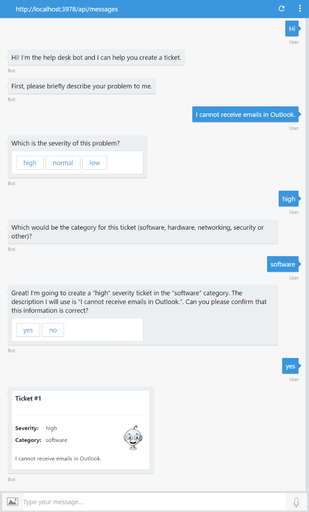

# Exercise 2: Submitting Help Desk Tickets with the Bot

In this exercise you will learn how to add conversation abilities to the bot to guide the user to create a help desk ticket.

Inside these folders for either [C#](./CSharp/exercise2-TicketSubmissionDialog) or [Node.js](./Node/exercise2-TicketSubmissionDialog) you will find a solution with the code that results from completing the steps in this exercise. You can use this solution as guidance if you need additional help as you work through this exercise.

## Goals

To successfully complete this exercise, your bot must be able to perform the following tasks:

* Inform the user the current capabilities of the bot
* Ask the user for information about the problem
* Create an in-memory API to store ticket information

Here is a sample converastion with the bot:

## Prerequisites

* You must have either completed the prior exercise, or you can use the starting point provided for either [C#](./CSharp/exercise1-EchoBot) or [Node.js](./Node/exercise1-EchoBot).
* A code editor like [Visual Studio Code](https://code.visualstudio.com/download) (for Node.js), or [Visual Studio 2017 Community](https://www.visualstudio.com/downloads) or higher for C#

## Introducing the Bot to the User

Whenever you create a bot you need to ensure the user knows what options are available to them. This is especially important when working in a conversational based interface, where the user tells the bot what she'd like the bot to do.

## Prompting for the Tickets Details

The trouble ticket needs to store the following information:

* Severity
  * High
  * Normal
  * Low
* Category
  * Software
  * Hardware
  * Networking
  * Security
* Description

The order in which the bot collects the information is up to you. You can use:

* A waterfall pattern for the conversation flow
* `Prompts.choice()` and `Prompts.text()` to prompt for the severity and category of the ticket.
* `Prompts.confirm()` to confirm that the ticket information is correct.

## In-memory Tickets API

Using either [Restify](http://restify.com/) for Node.js, or [Web API](https://www.asp.net/web-api) for C#, create a basic HTTP endpoint to store tickets in memory. The endpoint should accept POST calls with the ticket as the body of the message.

For purposes of this exercise, **no database or other eternal datastore** is needed; simply store the data in an array or list. The endpoint should be part of the same web application that hosts your bot.

> **NOTE:** When deploying your application to production, you may decide to separate your endpoint in a separate application. Typically you will be calling existing APIs.

## Adaptive Cards

You can also use an [Adaptive Cards](http://adaptivecards.io/) to show the ticket details.

* For Node.js you can use the [ticket.json](./assets/exercise2-TicketSubmissionDialog/ticket.json) file from the [assets](./assets) folder of the [hands-on lab](https://docs.microsoft.com/en-us/bot-framework/rest-api/bot-framework-rest-connector-add-rich-cards#adaptive-card).
* For C#, you can use the [Microsoft.AdaptiveCards NuGet package](https://docs.microsoft.com/en-us/bot-framework/dotnet/bot-builder-dotnet-add-rich-card-attachments#a-idadaptive-carda-add-an-adaptive-card-to-a-message).

## Further Challenges

If you want to continue working on your own you can try with these tasks:

* Send a welcome message to the bot relying on the conversationUpdate event, as explained in the [C#](https://docs.microsoft.com/en-us/bot-framework/dotnet/bot-builder-dotnet-activities#conversationupdate) and [Node](https://docs.microsoft.com/en-us/bot-framework/nodejs/bot-builder-nodejs-handle-conversation-events#greet-a-user-on-conversation-join) version.
* Send a typing indicator to the bot while it calls the Tickets API, as explained in the [C#](https://docs.microsoft.com/en-us/bot-framework/dotnet/bot-builder-dotnet-activities#typing) and [Node](https://docs.microsoft.com/en-us/bot-framework/nodejs/bot-builder-nodejs-send-typing-indicator) version.
* Update the data store for the trouble tickets to use a database, such as SQL Server, MongoDB, or Cosmos DB.

## Resources

* [Getting started with Web API](https://docs.microsoft.com/en-us/aspnet/web-api/overview/getting-started-with-aspnet-web-api/tutorial-your-first-web-api)
* [Routing in Restify](http://restify.com/#common-handlers-serveruse)
* [Prompt users for input in Node.js](https://docs.microsoft.com/en-us/bot-framework/nodejs/bot-builder-nodejs-dialog-prompt)
* [Manage conversation flow in C#](https://docs.microsoft.com/en-us/bot-framework/dotnet/bot-builder-dotnet-manage-conversation-flow)
* [Dialogs in the Bot Builder SDK for .NET](https://docs.microsoft.com/en-us/bot-framework/dotnet/bot-builder-dotnet-dialogs)