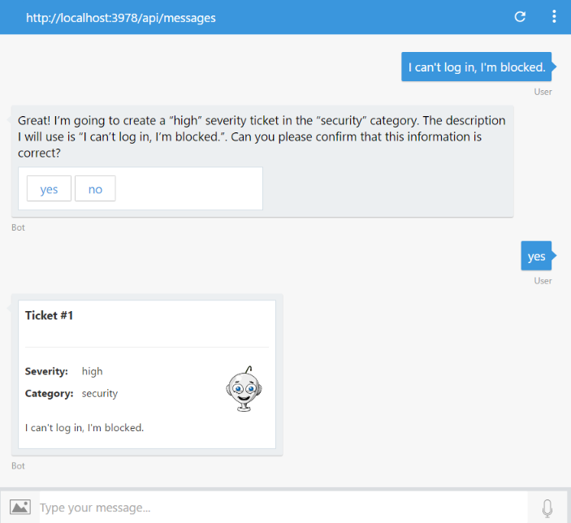

# Exercise 3: Making the Bot Smarter with Natural Language Processing (NLP)

In this exercise you will learn how to add natural language understanding abilities to the bot to enhance the user experience when creating a help desk ticket. Throughout this lab you will use LUIS (Language Understanding Intelligent Service), which is part of the Azure Cognitive Services offering.

One of the key problems in human-computer interactions is the ability of the computer to understand what a person wants. LUIS is designed to enable developers to build smart applications that can understand human language and accordingly react to user requests. With LUIS, a developer can quickly deploy an HTTP endpoint that will take the sentences sent to it and interpret them in terms of their intents (the intentions they convey) and entities (key information relevant to the intent).

Inside these folders for either [C#](./CSharp/exercise3-LuisDialog) or [Node.js](./Node/exercise3-LuisDialog) you will find a solution with the code that results from completing the steps in this exercise. You can use this solution as guidance if you need additional help as you work through this exercise.

## Goals

To successfully complete this exercise, your bot must be able to perform the following actions:

* Allow the user to type a full sentence describing his problem. The system should be able to detect:
  * When the user is submitting a help desk ticket
  * The severity (if provided)
  * The category (if provided)
* Update the bot to use the LUIS model

## Prerequisites

* You must have either completed the prior exercise, or you can use the starting point provided for either [C#](./CSharp/exercise2-TicketSubmissionDialog) or [Node.js](./Node/exercise2-TicketSubmissionDialog)
* An account in the [LUIS Portal](https://www.luis.ai)

## Using LUIS to Make the Bot Smarter with Language Understanding

You need to create a LUIS model with entities and utterances to be able to recognize the user intent together with ticket severity and category (entities). Here is a sample interaction with the bot:



> **NOTE:** In _Node.js_ you will be using `LuisRecognizer` to pass calls to LUIS. To avoid invoking LUIS when the user is in a dialog, you can use `onEnabled` to detect the current state of the bot and disable the recognizer.

  ```javascript
  var luisRecognizer = new builder.LuisRecognizer(process.env.LUIS_MODEL_URL).onEnabled((context, callback) => {
    var enabled = context.dialogStack().length === 0;
    callback(null, enabled);
  });
  bot.recognizer(luisRecognizer);
  ```

> **NOTE:** If you are already familiar with LUIS, you can import the file `luis_model.json` located under the [assets](assets/exercise3-LuisDialog) folder of this exercise into your account, train and publish the model. However, if you are new to LUIS, we recommend you work through creating the model from scratch for learning purposes.

## Further Challenges

If you want to continue working on your own you can try with these tasks:

* Add a cancel event handler to the `SubmitTicket` dialog.
* Add a custom dialog for providing help to the user when in `SubmitTicket`.
* Ensure `SubmitDialog` completes once started, unless cancel is called.
* Add the ability to the bot to ask for the status of a ticket. You would need to add a status property to the ticket and a new intent in the LUIS app that invokes a new dialog.

## Resources

* [Entities in LUIS](https://docs.microsoft.com/en-us/azure/cognitive-services/LUIS/luis-concept-entity-types)
* [Enable language understanding with LUIS in .NET](https://docs.microsoft.com/en-us/bot-framework/dotnet/bot-builder-dotnet-luis-dialogs)
* [Recognize user intent in Node.js](https://docs.microsoft.com/en-us/bot-framework/nodejs/bot-builder-nodejs-recognize-intent)
