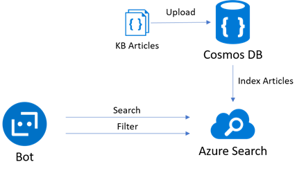
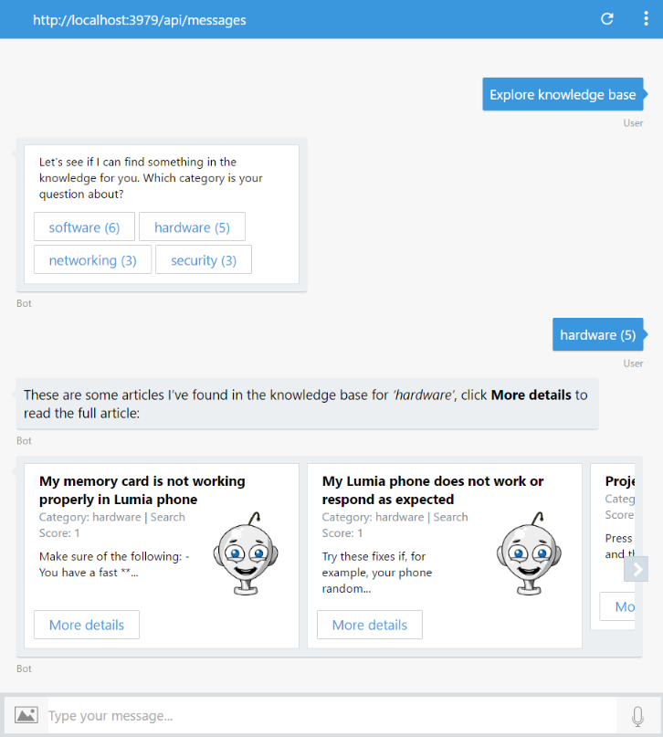

# Exercise 4: Implementing a Help Desk Knowledge Base with Azure Search and Cosmos DB

Your bots can also help the user navigate large amounts of content and create a data-driven exploration experience for users. In this exercise you will learn how to add search functionality to the bot to help users explore a knowledge base. To do this, you will connect the Bot to the Azure Search service that will index KB articles stored in an Azure Cosmos DB.

[Azure Cosmos DB](https://azure.microsoft.com/en-us/services/cosmos-db/) is Microsoft's globally distributed, multi-model database service for mission-critical applications. It supports different data models. In this exercise you will use its Document DB API, that will allow you to store knowledge base articles as JSON documents.

[Azure Search](https://azure.microsoft.com/en-us/services/search/) is a fully managed cloud search service that provides a rich search experience to custom applications. Azure Search can also index content from various sources (Azure SQL DB, Cosmos DB, Blob Storage, Table Storage), supports "push" indexing for other sources of data, can parse PDFs, Office documents, and other formats containing unstructured data. The content catalog goes into an Azure Search index, which you can then query from bot dialogs.

Inside these folders for either [C#](./CSharp/exercise4-KnowledgeBase) or [Node.js](./Node/exercise4-KnowledgeBase) you will find a solution with the code that results from completing the steps in this exercise. You can use this solution as guidance if you need additional help as you work through this exercise.

The following diagram illustrates how the components interact in this exercise:



## Goals

To successfully complete this exercise, your bot must be able to perform the following actions:

* Respond to an utterance like _explore knowledge base_ by listing the different categories of articles (software, hardware, networking, security) retrieving them from Azure Search throughout Facets. Then the bot should ask the user to choose one. If a category is typed, list some articles under that category.
* If the user types 'explore hardware' do not ask for the category and list the articles under the hardware category (use LUIS language understanding for this).
* Every article shown by the bot should have a "More Details" button that displays the article content
* If the user types 'show me the article Turn off OneDrive in windows 10' the bot should look an article with the "Turn off OneDrive in windows 10" in Azure Search.
* If the user types 'search onedrive' the bot should search the knowledge base with the OneDrive keyword.

Here is a sample interaction with the bot:



## Prerequisites

* You must have either completed the prior exercise, or you can use the starting point provided for either [C#](./CSharp/exercise3-LuisDialog) or [Node.js](./Node/exercise3-LuisDialog)
* An account in the [LUIS Portal](https://www.luis.ai)
* An [Azure](https://azureinfo.microsoft.com/us-freetrial.html?cr_cc=200744395&wt.mc_id=usdx_evan_events_reg_dev_0_iottour_0_0) subscription

## Create and Configure the Azure Services

You need to create an Azure Cosmos DB using the DocumentDB API then create a new collection. Use the Document Explorer to upload sample articles for your Knowledge Base. You can use the files in the [assets/kb](./assets/kb) folder.

Then create an Azure Search Service. Use the **Import data** function to index the content in Cosmos DB. When customizing the index make sure you mark the fields as shown in the following image:


For more information about Azure Search Indexes, see [this article](https://docs.microsoft.com/en-us/azure/search/search-what-is-an-index).

## Update the LUIS Model to Include the ExploreKnowledgeBase Intent

You need to add a new intent to your LUIS Model to handle the intent to search and explore the knowledge base. Some sample utterances can be:

* explore knowledge base
* explore hardware articles
* find me articles about hardware

## Update the Bot to call the Azure Search API

You should add code to query Azure Search using its REST API. The URL to use should look like this one:

```
https://helpdeskbotsearch.search.windows.net/indexes/knowledge-base-index/docs?api-key=79CF1B7A9XXXXXXXXX5E3532888C&api-version=2015-02-28&{query_placeholder}
```

Where the `{query_placeholder}` can be something like:

* `$filter=category eq 'hardware'`: to retrieve the articles within a category
* `$filter='title eq 'some title'`: to retrieve an article by title
* `search=OneDrive` to search for articles about OneDrive
* `facet=category` to list the categories and the number of articles within that category

For more information see these articles:

* [Query your Azure Search index](https://docs.microsoft.com/en-us/azure/search/search-query-overview)
* [OData Expression Syntax for Azure Search](https://docs.microsoft.com/en-us/rest/api/searchservice/odata-expression-syntax-for-azure-search)

## Update the Bot to Display Categories and Articles

There are many different ways in which you can implement the bot dialogs. Here is a proposal for each language:

In **Node.js** add the following Dialogs:

* A `SearchKB` dialog that matches the `/^search about (.*)/i` regex and performs a free text search in Azure Search using the `search=...` query.
* An `ExploreKnowledgeBase` dialog for the "explore {category}" utterance with two waterfall steps. The first one tries to get the category detected by Luis, if not found, retrieve the list of categories from Azure Search and presents them to the user using `builder.Prompts.choice()`. The second Waterfall performs a search by article category using a `$filter=category eq '{category}'` query. The results are shown in a new `ShowKBResults` dialog.
* The `ShowKBResults` dialog shows each article using a carousel of `builder.ThumbnailCard(session)`. To display a carousel you should use: `builder.Message(session).attachmentLayout(builder.AttachmentLayout.carousel);`
* A third `DetailsOf` dialog that matches the `/^show me the article (.*)/i` regex and performs a search by title in Azure Search using a `$filter=title eq '${title}'` query.

In **C#** add the following Dialogs and Scorables:

* Create a `CategoryExplorerDialog` that if the category was not detected retrieves the list of categories from Azure Search and presents them to the user using `PromptDialog.Choice()`. If the category is present performs a search by article category using a `$filter=category eq '{category}'` query. The results are shown using a carousel of `CardImage`.
* In `RootDialog.cs` add a method tagged with the `[LuisIntent("ExploreKnowledgeBase")]` attribute that extracts the category and calls the `CategoryExplorerDialog`.
* Create a `SearchScorable` that looks for the _"search about"_ text in user messages and performs a free text search in Azure Search using the `search=...` query.
* Create a `ShowArticleDetailsScorable` that looks for the _"show me the article"_ text in user messages and performs a search by title in Azure Search using a `$filter=title eq '${title}'` query.
* Make sure you register them in the `Application_Start()` method of Global.asax.

For more information about `Scorables`, see [this sample](https://github.com/Microsoft/BotBuilder-Samples/tree/master/CSharp/core-GlobalMessageHandlers).

## Further Challenges

If you want to continue working on your own you can try with these tasks:

* You can change the article `ThumbnailCard` used in the carousel with an Adaptive Card. You can use the code provided [here](../assets/exercise4-KnowledgeBase/FurtherChallenge/articlesCard.js) as an example for node.js or [here](../assets/exercise4-KnowledgeBase/FurtherChallenge/CardUtil.cs) for C#
* Instead of showing a fixed image in the article `ThumbnailCard`, you can use the [Bing Image Search API](https://azure.microsoft.com/en-us/services/cognitive-services/bing-image-search-api/) to show a relevant image related to the category of the article. You can use the resources from the [assets](../assets/exercise4-KnowledgeBase/FurtherChallenge/) folder of the hands-on lab.

## Resources

* [Azure Search](https://azure.microsoft.com/en-us/services/search/)
* [Azure Cosmos DB](https://azure.microsoft.com/en-us/services/cosmos-db/)
* [Implement global message handlers using Scorables](https://docs.microsoft.com/en-us/bot-framework/dotnet/bot-builder-dotnet-global-handlers)
