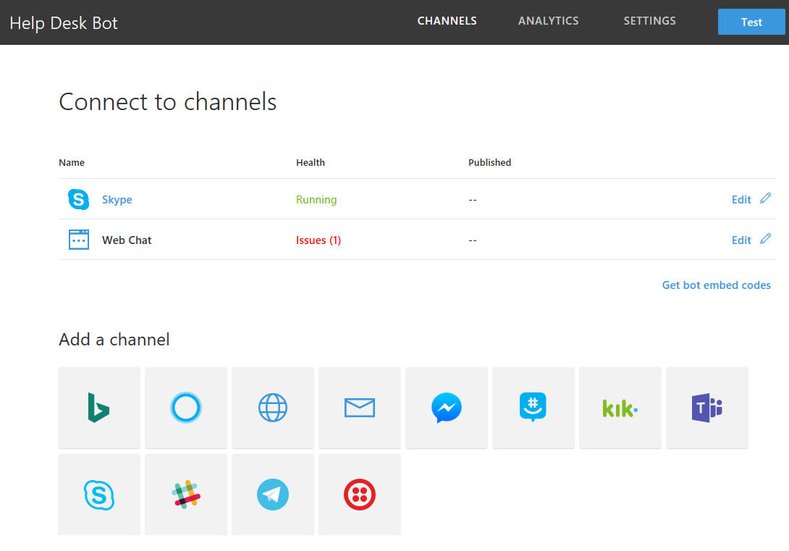
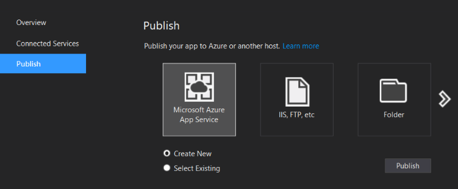

# Exercise 5: Deploying Your Bot to the Cloud

In this exercise you will learn how to register your bot and deploy it to Azure so others can use it.

## Goals

To successfully complete this exercise you should be able to perform the following actions:

* Register your bot in the [Bot Framework Portal](https://dev.botframework.com)
* Create an Azure Web App and publish your bot code there

## Prerequisites

* You must have either completed the prior exercise, or you can use the starting point provided for either [C#](./CSharp/exercise4-LuisDialog) or [Node.js](./Node/exercise4-LuisDialog)
* An [Azure](https://azureinfo.microsoft.com/us-freetrial.html?cr_cc=200744395&wt.mc_id=usdx_evan_events_reg_dev_0_iottour_0_0) subscription
 * In Node.js you must have [Git command line interface](https://git-scm.com/downloads)
* An [Skype](https://www.skype.com) account (optional)

## Register the Bot with the Bot Framework

Before others can use your bot, you must register it with the Bot Framework. Registration is a simple process. You are prompted to provide some information about your bot and then the portal generates the app ID and password that your bot will use to authenticate with the Bot Framework.

## Publish your Bot to Azure

Before others can use your bot, you must deploy it to the cloud. You can deploy it to Azure or to any other cloud service.

### Node.js

You need to add **App Settings** keys to your Web App like follows:

Key | Description |
----|-------------|
AZURE\_SEARCH\_ACCOUNT | Use the **Azure Search account name** |
AZURE\_SEARCH\_INDEX | Use the **Azure Search index name** |
AZURE\_SEARCH\_KEY | Use the **Azure Search key** |
MICROSOFT\_APP\_ID | Use the **Bot App ID** |
MICROSOFT\_APP\_PASSWORD | Use the **Bot Password** |
LUIS\_MODEL\_URL | Use the **LUIS model URL** |
TICKET\_SUBMISSION\_URL | Use your Web App URL (eg. https://help-desk-bot.azurewebsites.net/) |

You need to configure the Web App to support deployments from a local git repository and setup your deployment credentials. Next, you need to add that local git repository to your project. When you push your changes to the repository the code is automatically published to the Web app.

### C#

You should publish your bot directly from Visual Studio to a Web App. If you don't have any created, you can create one. Otherwise, you can pick an existing one.

You need to add **App Settings** keys to your Web App like follows:

Key | Description |
----|-------------|
AzureSearchAccount | Use the **Azure Search account name** |
AzureSearchIndex | Use the **Azure Search index name** |
AzureSearchKey | Use the **Azure Search key** |
MicrosoftAppId | Use the **Bot App ID** |
MicrosoftAppPassword | Use the **Bot Password** |
TicketsAPIBaseUrl | Use your Web App URL (eg. https://help-desk-bot.azurewebsites.net/) |

## Update Your Bot Configuration

You need to update the _App Service URL_ for your bot in the **Bot Framework Portal** with the URL of the Web App. Remember to put the `/api/messages` at the end of the URL and ensure the protocol is **https**.

> **NOTE:** At this point you can test your published bot in the **Web Channel Control** in the **Bot Framework Portal** and Skype also (you will need to install Skype).

## Further Challenges

* Test the bot from the Bot Emulator - you need to use [ngrok](https://docs.microsoft.com/en-us/bot-framework/debug-bots-emulator#a-idngroka-install-and-configure-ngrok) to let the bot know how to reply to your local computer.
* [Run code locally](https://blogs.msdn.microsoft.com/jamiedalton/2016/07/29/ms-bot-framework-ngrok/) while testing the bot via Skype or WebChat.
* You can try adding [Bot Analytics by using Application Insights](https://docs.microsoft.com/en-us/bot-framework/portal-analytics-overview).
* Register the bot with another channel, such as [Slack](https://slack.com/).

## Resources

* [Register a bot with the Bot Framework](https://docs.microsoft.com/en-us/bot-framework/portal-register-bot)
* [Deploy a bot to Azure from a local git repository](https://docs.microsoft.com/en-us/bot-framework/deploy-bot-local-git)
* [Deploy from Visual Studio](https://docs.microsoft.com/en-us/bot-framework/deploy-bot-visual-studio)
* [Connect to Skype Channel](https://dev.skype.com/bots)
