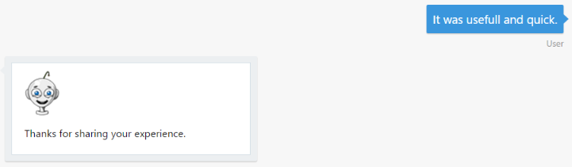

# Exercise 6: Determine the Sentiments Behind a User's Message

The interaction between users and bots is mostly free-form, so bots need to understand language naturally and contextually. In this exercise you will learn how to detect the user's sentiments and mood using the Azure Text Analytics API.

With [Text Analytics APIs](https://azure.microsoft.com/en-us/services/cognitive-services/text-analytics/), part of the Azure Cognitive Services offering, you can detect sentiment, key phrases, topics, and language from your text. The API returns a numeric score between 0 and 1. Scores close to 1 indicate positive sentiment and scores close to 0 indicate negative sentiment. Sentiment score is generated using classification techniques.

Inside these folders for either [C#](./CSharp/exercise6-MoodDetection) or [Node.js](./Node/exercise6-MoodDetection) you will find a solution with the code that results from completing the steps in this exercise. You can use this solution as guidance if you need additional help as you work through this exercise.

## Goals

To successfully complete this exercise, your bot must be able to perform the following actions:

* Ask the user for feedback after the ticket is submitted
* Analyze the feedback with Text Analytics Service to detect positive or negative sentiments - depending on the score returned and send a different message 

Here are some sample interactions with the bot:

## Prerequisites

* You must have either completed the prior exercise, or you can use the starting point provided for either [C#](./CSharp/exercise4-KnowledgeBase) or [Node.js](./Node/exercise4-KnowledgeBase)
* An [Azure](https://azureinfo.microsoft.com/us-freetrial.html?cr_cc=200744395&wt.mc_id=usdx_evan_events_reg_dev_0_iottour_0_0) subscription

## Create the Text Analytics Service

You need to create a Text Analytics Key from the Language tab in the [Cognitive Services Portal](https://azure.microsoft.com/en-us/try/cognitive-services/). Next,
you should create a Text Analytics REST API client to consume the **Text Analytics Service**. You should make a POST call to the following URL: https://westus.api.cognitive.microsoft.com/text/analytics/v2.0/sentiment as explained in [this article]((https://docs.microsoft.com/en-us/azure/cognitive-services/text-analytics/quick-start#task-2---detect-sentiment-key-phrases-and-languages))

## Modify the Bot to Ask for Feedback and Analyze the User's Sentiments

You can create a new Dialog to ask for user experience feedback an call it when the ticket submission creation is complete. Then, call the **Text Analytics Service** using the API Client created and response to user with different message based on the result. If the feedback is positive (score >= 0.5) the bot just thanks the user. Otherwise (score < 0.5), it tells the user that an IT responsible will contact him soon. Note that in the next exercise (7) you will learn how to hand-off the conversation to a human in case of negative feedback so he can assist the user.

## Further Challenges

* You can add Speech Recognition to the bot by using another Microsoft Cognitive Service. You can try the [Bing Speech API](https://azure.microsoft.com/en-us/services/cognitive-services/speech/).

## Resources

* [Text Analytics API Overview](https://docs.microsoft.com/en-us/azure/cognitive-services/text-analytics/overview)
* [Text Analytics API QuickStart](https://docs.microsoft.com/en-us/azure/cognitive-services/text-analytics/quick-start#task-2---detect-sentiment-key-phrases-and-languages)
