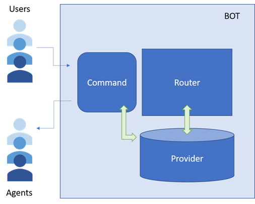
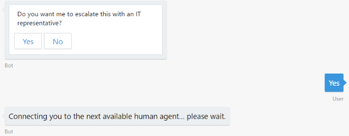
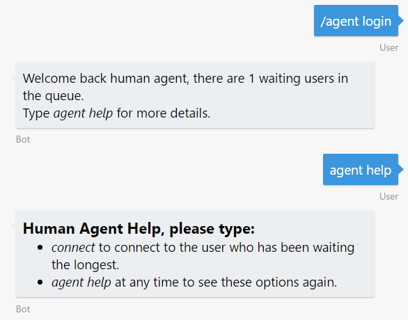
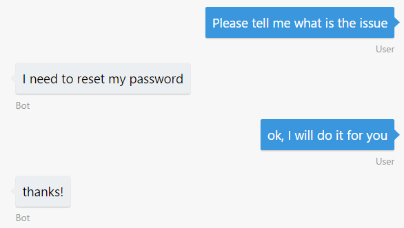
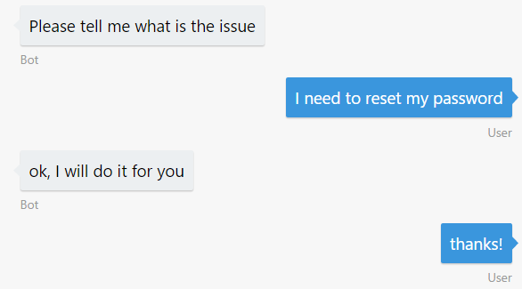

# Exercise 7: Hand off the Conversation to a Human Agent

Regardless of how much artificial intelligence a bot possesses, there may still be times when it needs to hand off the conversation to a human being. For example you want to build a bot that automatically replies some questions and is able to meet your customers wherever they are, but still be able to escalate issues to a human. Or if the bot couldn't handle every situation, or there were edge cases, the bot should be able to pass off to a person who had the right authority. The bot should recognize when it needs to hand off and provide the user with a clear, smooth transition. In this exercise, you will learn how you can use a bot to initiate a conversation with a user, and then hand off context to a human agent.

The handoff bot pattern is further explained in [this article](https://docs.microsoft.com/en-us/bot-framework/bot-design-pattern-handoff-human).

Inside these folders for either [C#](./CSharp/exercise7-HandOffToHuman) or [Node.js](./Node/exercise7-HandOffToHuman) you will find a solution with the code that results from completing the steps in this exercise. You can use this solution as guidance if you need additional help as you work through this exercise.

Please notice that there are several ways in which you can implement the hand-off logic, this hands-on lab uses an approach similar to the implemented in [this sample](https://github.com/palindromed/Bot-HandOff).

This diagram outlines the components of the bot for this exercise.



## Goals

To successfully complete this exercise, your bot must be able to perform the following actions:

* When the bot asks for feedback after the creation of the ticket (from exercise 6), if the user sentiment is negative put him in a queue to talk to a human agent.
* When the bot receives a command with the text _"/agent login"_, mark that the conversation is from a human agent. After this happens, this user is able to:
    * Type _"connect"_ to connect to a human agent. In this state, all the messages that the agent types are forwarded to the user. The same happens the other way around. The bot is transformed in a "message forwarder".
    * Type _"help"_ to get the list of commands (optional).
    * Type _"resume"_ to disconnect from the user and talk back to the bot.

Here are some sample interactions with the bot:





| Agent messages | User messages |
|---|---|
|  |  |

## Prerequisites

* You must have either completed the prior exercise, or you can use the starting point provided for either [C#](./CSharp/exercise6-MoodDetection) or [Node.js](./Node/exercise6-MoodDetection)
* An account in the [LUIS Portal](https://www.luis.ai)
* An [Azure](https://azureinfo.microsoft.com/us-freetrial.html?cr_cc=200744395&wt.mc_id=usdx_evan_events_reg_dev_0_iottour_0_0) subscription

## Implementing the Handoff Mechanism

For implementing this scenario it will be easier if you use some pre-defined assets provided in this hands-on lab.

In **Node.js** you can do the following:

1. In LUIS, add **HandOffToHuman** intent with the following utterances:
    * _I want to talk to an IT representative_
    * _Contact me to a human being_

1. Copy the following files from the [assets](./assets) folder of the hands-on lab:

    * [`provider.js`](./assets/exercise7-HandOffToHuman/provider.js) which builds a queue with the users waiting for a human agent. Each conversation has 3 states: `ConnectedToBot`, `WaitingForAgent`, `ConnectedToAgent`. Dending on the state, the router (which you will build in the next step), will direct the messages to one conversation or the other. Notice that this module does not persist the queue in an external storage. This is also where the conversations metadata is stored.

    * [`command.js`](./assets/exercise7-HandOffToHuman/command.js) to handle the special interaction between the agent and the bot to peek a waiting user to talk or to resume a conversation. This module has a [middleware](./assets/exercise7-HandOffToHuman/command.js#L9) that intercepts messages from human agents and route them to the options to connect or resume communications with users.

1. Create a router.js file. The router will be in charge of knowing each message needs to be sent to, either to the agent or the user. The main function exposed by the router should look similar to the following code:

    ```javascript
    const middleware = () => {
        return {
            botbuilder: (session, next) => {
                if (session.message.type === 'message') {
                    if (isAgent(session)) {
                        routeAgentMessage(session);
                    } else {
                        routeUserMessage(session, next);
                    }
                } else {
                    next();
                }
            }
        };
    };
    ```

1. In the app.js of the bot connect each middleware to the bot by using `bot.use(...)`.

    ```javascript
    const handOffRouter = new HandOffRouter(bot, (session) => {
        // agent identification goes here
        return session.conversationData.isAgent;
    });
    const handOffCommand = new HandOffCommand(handOffRouter);

    bot.use(handOffCommand.middleware());
    bot.use(handOffRouter.middleware());
    ```

In **C#** you can do the following:

1. Use the following files from the `assets` folder of the hands-on lab:

    * [`AgentExtensions.cs`](./assets/exercise7-HandOffToHuman/AgentExtensions.cs): Contains a simple logic to convert a normal user to an Agent and to identify an Agent. You can use this to implement your own logic going forward for managing conversations, users and agents.

    * [`Provider.cs`](./assets/exercise7-HandOffToHuman/Provider.cs): Builds a queue with the users waiting for a human agent. Notice that this class does not persist the queue in an external storage. This is also where the conversations metadata is stored. If you wanted to store a conversation in a data store, you could either update or inherit from `Provider` with your custom implementation.

    * [`CommandScorable.cs`](./assets/exercise7-HandOffToHuman/CommandScorable.cs): This Scorable is reached when the message is from an Agent and only triggers its resolution when receives `agent help`, `connect` or `resume` messages. If the user message doesn't match those it is not processed with this Scorable.

    * [`AgentLoginScorable.cs`](./assets/exercise7-HandOffToHuman/AgentLoginScorable.cs) class that manages the switching between normal users and human agents.

1. Create an `RouterScorable.cs` that will be in charge of knowing where each message needs to be sent to, either to the agent or the user. The `PrepareAsync` method should look similar to the following code.

    ```csharp
    protected override async Task<ConversationReference> PrepareAsync(IActivity activity, CancellationToken token)
    {
        var message = activity as Activity;

        if (message != null && !string.IsNullOrWhiteSpace(message.Text))
        {
            // determine if the message comes from an agent or user
            if (this.botData.IsAgent())
            {
                return this.PrepareRouteableAgentActivity(message.Conversation.Id);
            }
            else
            {
                return this.PrepareRouteableUserActivity(message.Conversation.Id);
            }
        }

        return null;
    }
    ```

1. The `PrepareRouteableUserActivity` should return the correct instance of `ConversationReference` where to send the message to depending from the Conversation State.

    ```csharp
    protected ConversationReference PrepareRouteableUserActivity(string conversationId)
    {
        var conversation = this.provider.FindByConversationId(conversationId);
        if (conversation == null)
        {
            conversation = this.provider.CreateConversation(this.conversationReference);
        }

        switch (conversation.State)
        {
            case ConversationState.ConnectedToBot:
                return null; // continue normal flow
            case ConversationState.WaitingForAgent:
                return conversation.User;
            case ConversationState.ConnectedToAgent:
                return conversation.Agent;
        }

        return null;
    }
    ```

1. Make sure you register the scorables in the `Application_Start()` method of Global.asax.

## Further Challenges

If you want to continue working on your own you can try with these tasks:

* Create a custom provider to store conversation data in an external data store, such as Cosmos DB or SQL Server.
* Add authentication for the `AgentMenu` dialog. You would need to add [Sign-inCard](https://docs.botframework.com/en-us/node/builder/chat-reference/classes/_botbuilder_d_.signincard.html) to invoke your user's authentication process.
* Modify the [`provider.js`](./assets/exercise7-HandOffToHuman/provider.js#L13) for Node.js or [`Provider.cs`](./assets/exercise7-HandOffToHuman/Provider.cs) for C# to add conversation data persistence. As it is now, the active conversations are stored in-memory and it's difficult to scale the bot.
* You could implement a new state in the router for watching the conversation. In this case, the users and bot's messages are sent to the human agent for him to monitor.
* When the bot is waiting for a human, it will automatically answer all incoming user messages with a default response. You could have the bot remove the conversation from the 'waiting' state if the user sent certain messages such as _"never mind"_ or _"cancel"_.
* Another alternative for hand-off would be to add a button in the help dialog that hands-off the conversation to a human.

## Resources

* Hand off session from [BUILD 2017](https://channel9.msdn.com/Events/Build/2017/P4075)
* [Hand off pattern explanation](https://docs.microsoft.com/en-us/bot-framework/bot-design-pattern-handoff-human)