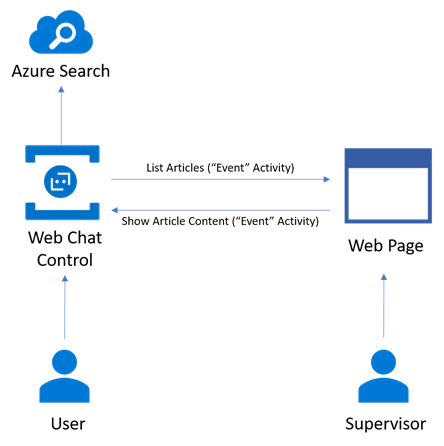

# Exercise 8: Send and Receive Events Through a Backchannel

The backchannel mechanism allows a client app and the bot to exchange information that is invisible to the user. Examples of this could be from requesting the client's time zone to reading a GPS location or what the user is doing on a web page. The bot can even guide the user by automatically filling out parts of a web form and so on. The backchannel closes the gap between JavaScript client apps and bots. This mechanism is implemented by using the Direct Line API, which allows activities to be sent back and forth between the client and the bot.

In this exercise, you will add a Web Page to your app. The bot and web page will use the backchannel mechanism to communicate. The bot will send the user's ticket to the web page, which will display related KB articles for that ticket. The goal would be that a human supervisor agent can monitor the conversation and by using the web page decide if there is an article that can help the user and avoid the creation of a ticket. If he finds an article, the supervisor agent can click it to display it in the user conversation with the bot.

More information about the pattern can be found in the [backchannel article in the documentation](https://docs.microsoft.com/en-us/bot-framework/nodejs/bot-builder-nodejs-backchannel).

Inside these folders for either [C#](./CSharp/exercise8-BackChannel) or [Node.js](./Node/exercise7-BackChannel) you will find a solution with the code that results from completing the steps in this exercise. You can use this solution as guidance if you need additional help as you work through this exercise.

This diagram outlines the components of this exercise:



## Goals

To successfully complete this exercise, your bot must be able to perform the following actions interacting with the web page:

* When a user types the description of the ticket, the bot should perform a search in Azure Search and send the returned articles through a backchannel to a web app
* When the supervisor clicks on an article on the Web, the bot should display the article content

Here are some sample interactions with the bot and the web app:


## Prerequisites

* You must have either completed the prior exercise, or you can use the starting point provided for either [C#](./CSharp/exercise7-HandOffToHuman) or [Node.js](./Node/exercise7-HandOffToHuman)
* An account in the [LUIS Portal](https://www.luis.ai)
* An [Azure](https://azureinfo.microsoft.com/us-freetrial.html?cr_cc=200744395&wt.mc_id=usdx_evan_events_reg_dev_0_iottour_0_0) subscription

## Implementing the Backchannel Mechanism

### Client-side Code

* You should add an HTML page to your bot app. You can use [this one](../assets/exercise8-BackChannel/default.htm) provided in the [assets](./assets) folder.

* Using the  [Bot Framework Portal](https://dev.botframework.com) you should add a new App in the Web Chat channel of your bot to get the secret key. Then use it to open the [Direct Line](https://docs.botframework.com/en-us/restapi/directline3/) in the Web Page.

    ```javascript
    var botConnection = new BotChat.DirectLine({
        secret: '{DIRECTLINE_SECRET}'
    });
    ```

* You should embed a Web Chat control in the web page, as explained [here](https://github.com/Microsoft/BotFramework-WebChat).

* Add a bot activity listener for activities where `type="event"` and `name="searchResults"`. Then show the search results sent by the bot through the backchannel.

    ```javascript
    botConnection.activity$
        .filter(function (activity) {
            return activity.type === 'event' && activity.name === 'searchResults';
        })
        .subscribe(function (activity) {
            // show the search results
        });
    ```

* When the agent clicks on a title post an activity through the backchannel to call a bot event.

    ```javascript
     botConnection
        .postActivity({
            type: 'event',
            value: this.textContent.trim(),
            from: { id: 'user' },
            name: 'showDetailsOf'
        });
    ```

> **NOTE:** For simplicity purposes the Web Chat control with the user conversation and the search results are displayed on the same page. However, ideally these should be two separate things. The supervisor web site should display the list of the conversations in progress so an agent can monitor one and send the article recommendations.

### Server-side Code

* Update the bot `SubmitTicket` dialog to perform a search in Azure Search with the ticket description and send a message of type `ActivityTypes.Event` with the results.

* Use the `bot.on()` event listener in Node.js and an the `Post` method of the `MessagesController` in C# to listen to messages of types `ActivityTypes.Event` sent by the web page, and respond accordingly.

    ```javascript
    bot.on(`event`, function (event) {
        var msg = new builder.Message().address(event.address);
        msg.data.textLocale = 'en-us';
        if (event.name === 'showDetailsOf') {
            // search for article and display it
        }
    });
    ```

    ```csharp
    public async Task<HttpResponseMessage> Post([FromBody]Activity activity)
    {
        if (activity.Type == ActivityTypes.Message)
        {
            await Conversation.SendAsync(activity, () => new RootDialog());
        }
        else if (activity.Type == ActivityTypes.Event)
        {
            // search for article and display it
        }

        ...
    }
    ```

## Further Challenges

* Integrate bot to human handoff with backchannel to allow an agent to see all current users talking with the bot, and then allow the agent to connect to a specific user.

## Resources

* [Microsoft Bot Framework WebChat control](https://github.com/Microsoft/BotFramework-WebChat)
* [Direct Line API](https://docs.botframework.com/en-us/restapi/directline3/#navtitle)
* [BackChannel Sample](https://github.com/Microsoft/BotFramework-WebChat/blob/master/samples/backchannel/index.html)
* [Backchannel Bot](https://github.com/ryanvolum/backChannelBot)
